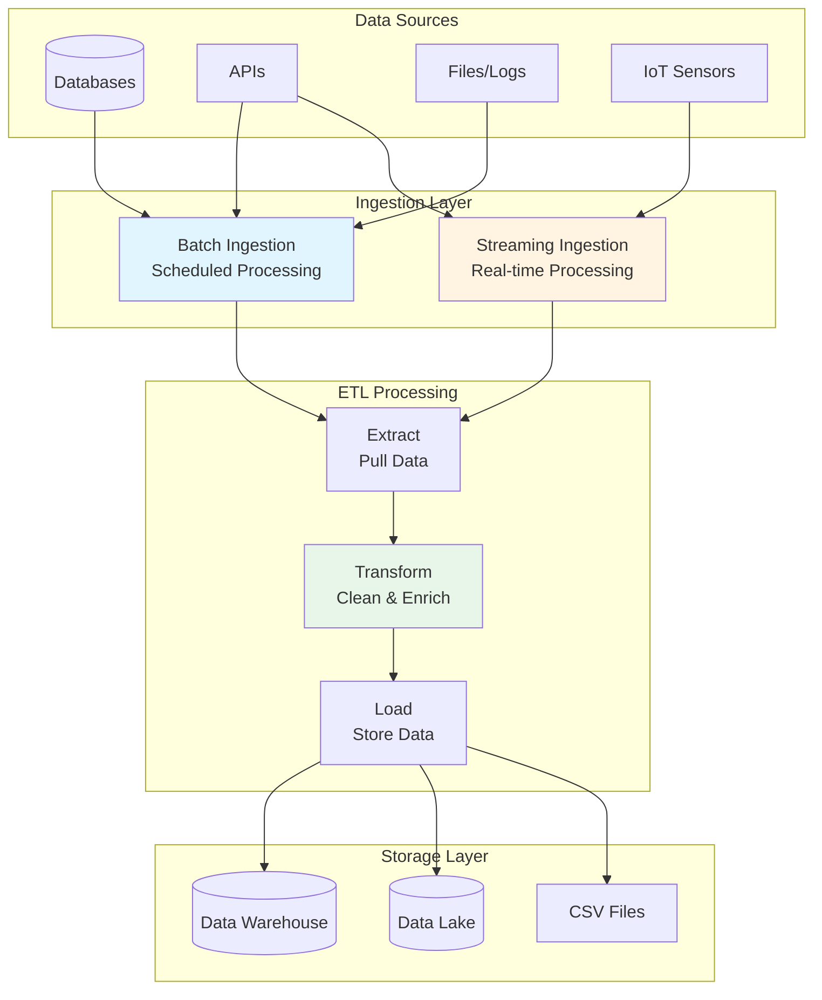
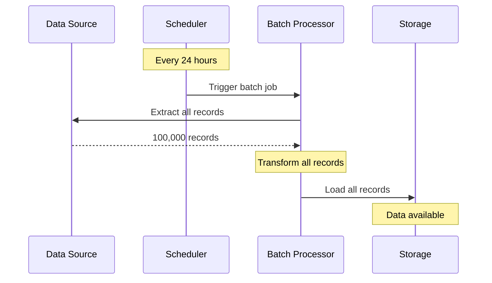
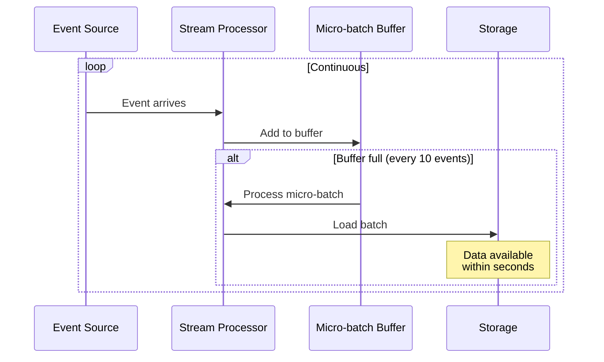
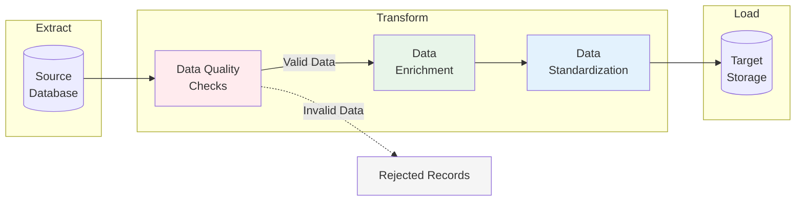
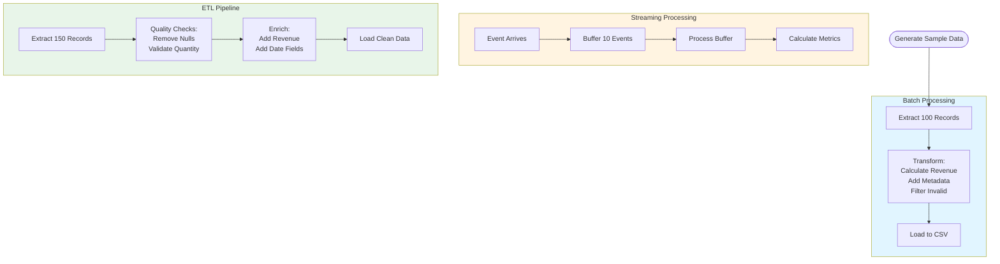
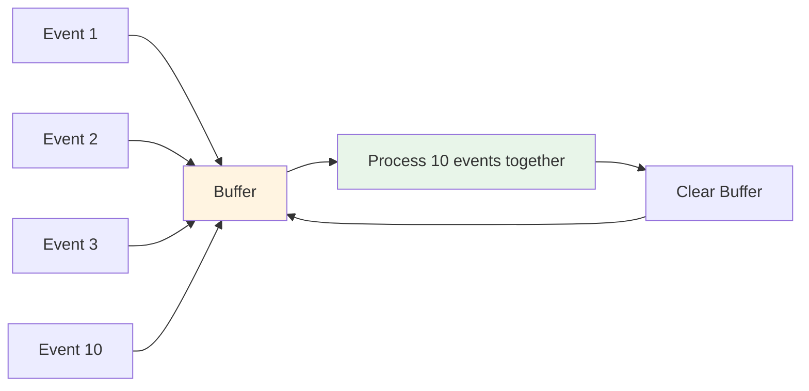
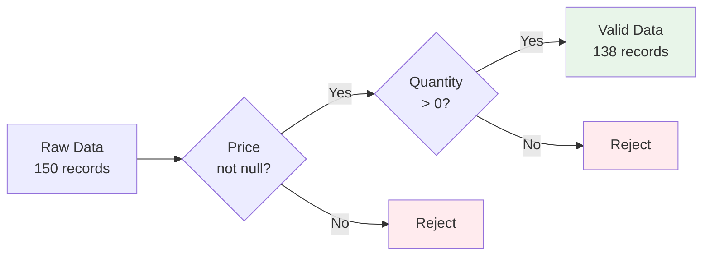

# Data Ingestion Patterns Demo

A beginner-friendly guide to understanding data ingestion patterns with hands-on examples. This project demonstrates three core data engineering concepts: Batch Ingestion, Streaming Ingestion, and ETL Pipelines.

## Table of Contents
- [What is Data Ingestion?](#what-is-data-ingestion)
- [Architecture Overview](#architecture-overview)
- [Ingestion Patterns](#ingestion-patterns)
- [Getting Started](#getting-started)
- [Understanding the Code](#understanding-the-code)
- [Key Concepts](#key-concepts)

## What is Data Ingestion?

Data ingestion is the process of collecting, importing, and processing data from various sources into a storage system where it can be accessed and analyzed. Think of it as the "front door" of your data infrastructure.

## Architecture Overview



## Ingestion Patterns

### 1. Batch Ingestion

**What:** Process large volumes of data at scheduled intervals (hourly, daily, weekly)

**When to use:**
- Historical analysis and reporting
- Large datasets that don't need immediate processing
- Scheduled/periodic updates (daily reports, monthly aggregations)
- Complex transformations



**Pros:** Efficient for large volumes, simpler to implement, lower cost
**Cons:** Not real-time, delays between data creation and availability

### 2. Streaming Ingestion

**What:** Process data continuously in real-time as events arrive

**When to use:**
- Real-time analytics and dashboards
- Time-sensitive applications (fraud detection, alerts)
- Continuous data sources (IoT sensors, user activity)
- When data value decreases rapidly over time



**Pros:** Low latency, immediate insights, continuous processing
**Cons:** More complex infrastructure, higher cost, harder to debug

### 3. ETL Pipeline

**What:** Extract, Transform, Load - a structured approach to data movement with quality checks



**Key Steps:**
1. **Extract:** Pull data from source
2. **Transform:**
   - Data Quality Checks (remove nulls, validate business rules)
   - Data Enrichment (add calculated fields like revenue)
   - Data Standardization (normalize formats)
3. **Load:** Write to destination storage

## Getting Started

### Prerequisites
```bash
pip install pandas
```

### Running the Demo
```bash
python day1_data_ingestion.py
```

### Expected Output
The script will generate:
- `batch_output.csv` - Results from batch processing
- `etl_output.csv` - Results from ETL pipeline
- Console output showing each step of the process

## Understanding the Code

### Data Flow Example



### Key Code Sections

**Batch Ingestion (Lines 55-128):**
- Processes all 100 records at once
- Vectorized operations for efficiency
- Aggregations across entire dataset

**Streaming Ingestion (Lines 153-258):**
- Processes events one-by-one
- Uses micro-batching (buffer of 10)
- Simulates real-time with 100ms delays

**ETL Pipeline (Lines 264-398):**
- Introduces data quality issues
- Demonstrates quality checks
- Shows data enrichment and standardization

## Key Concepts

### Micro-batching


Small groups of events processed together for efficiency, balancing latency and throughput.

### Data Quality Checks


### When to Use Each Pattern

| Pattern | Latency | Complexity | Cost | Use Case |
|---------|---------|------------|------|----------|
| **Batch** | Hours/Days | Low | Low | Daily reports, historical analysis |
| **Streaming** | Seconds | High | High | Fraud detection, live dashboards |
| **ETL** | Varies | Medium | Medium | Data warehousing, quality-critical data |


## Real-World Examples

- **Batch:** Bank processes end-of-day transactions, Netflix generates viewing reports
- **Streaming:** Uber tracks driver locations, Twitter updates trending topics
- **ETL:** Healthcare systems load patient records, E-commerce sites sync inventory

## Further Reading

- [Batch vs Stream Processing](https://aws.amazon.com/streaming-data/)
- [ETL Best Practices](https://cloud.google.com/architecture/etl-best-practices)
- [Lambda Architecture](https://en.wikipedia.org/wiki/Lambda_architecture)

## License

This is an educational demo project for learning data ingestion concepts.
