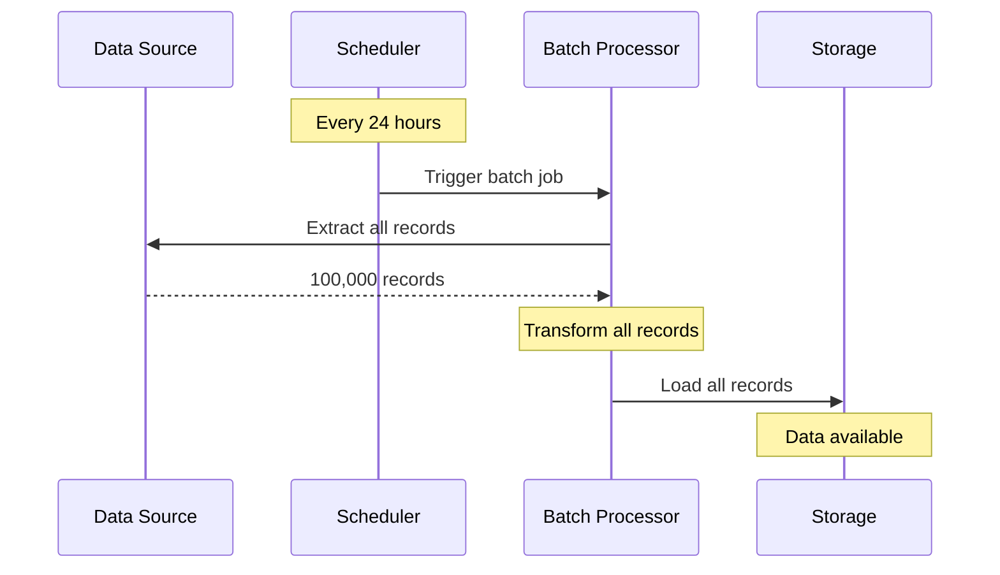
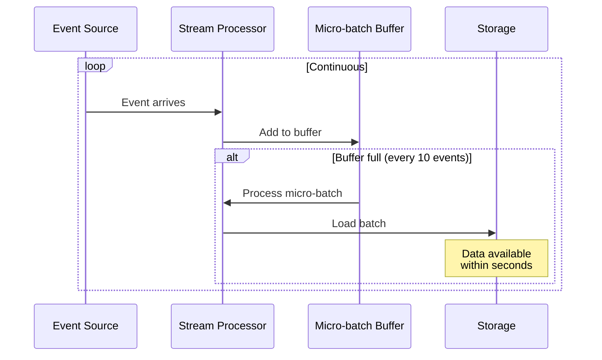
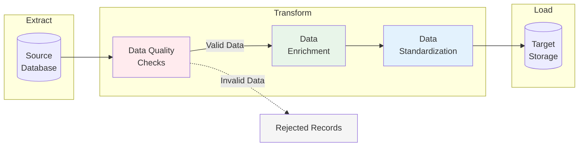

# Understanding Data Ingestion: A Beginner's Guide

Data ingestion is the process of collecting, importing, and loading data from various sources into a centralized system where it can be stored, processed, and analyzed. Think of it as the "front door" of your data infrastructure - it's how data enters your system.

## Table of Contents
- [What is Data Ingestion?](#what-is-data-ingestion)
- [Types of Data Ingestion](#types-of-data-ingestion)
- [Data Ingestion Techniques](#data-ingestion-techniques)
- [Popular Data Ingestion Tools](#popular-data-ingestion-tools)
- [Best Practices](#best-practices)
- [Getting Started](#getting-started)

## What is Data Ingestion?

Data ingestion is the foundation of any data pipeline. It involves:
- **Collecting** data from multiple sources (databases, APIs, files, IoT devices)
- **Importing** that data into your system
- **Loading** it into a destination (data warehouse, data lake, or cloud platform)

This process is crucial for organizations that need to consolidate data from various sources for analytics, machine learning, or business intelligence.

## Types of Data Ingestion

### 1. Batch Ingestion

Batch ingestion collects and processes data at scheduled intervals - hourly, daily, or weekly.



**Use Cases:**
- End-of-day sales reports
- Monthly financial aggregations
- Historical data analysis
- Data warehousing

**Pros:**
- Efficient for large volumes
- Lower infrastructure costs
- Simpler to implement

**Cons:**
- Not real-time
- Delays between data creation and availability

### 2. Real-time/Streaming Ingestion

Streaming ingestion processes data continuously as it arrives, enabling immediate insights.



**Use Cases:**
- Fraud detection systems
- Live dashboards and monitoring
- IoT sensor data processing
- Real-time recommendations

**Pros:**
- Low latency (seconds)
- Immediate insights
- Continuous processing

**Cons:**
- More complex infrastructure
- Higher operational costs
- Requires specialized skills

## Data Ingestion Techniques

### ETL (Extract, Transform, Load)

ETL is the traditional and most widely used data ingestion technique:



**ETL Steps:**

1. **Extract**: Pull data from source systems
2. **Transform**:
   - Data quality checks (validate, remove nulls)
   - Data enrichment (add calculated fields)
   - Data standardization (normalize formats)
3. **Load**: Write processed data to destination

### ELT (Extract, Load, Transform)

A modern alternative where data is loaded first, then transformed in the target system. This approach leverages the processing power of modern cloud data warehouses.

## Popular Data Ingestion Tools

### Open Source
- **Apache Kafka**: Distributed streaming platform for real-time data pipelines
- **Apache NiFi**: Data routing and transformation tool
- **Apache Airflow**: Workflow orchestration for batch pipelines

### Cloud-Based
- **AWS Glue**: Serverless ETL service
- **Google Cloud Dataflow**: Unified stream and batch processing
- **Azure Data Factory**: Cloud ETL and data integration service

### Commercial
- **Fivetran**: Automated data integration
- **Stitch**: Simple, self-service ETL
- **Talend**: Enterprise data integration platform

## Best Practices

### 1. Data Quality
- Implement validation rules at ingestion time
- Remove duplicates and handle missing values
- Monitor data quality metrics continuously

### 2. Scalability
- Design for growth - consider future data volumes
- Use distributed systems for large-scale ingestion
- Implement proper partitioning strategies

### 3. Error Handling
- Build retry mechanisms for transient failures
- Log all errors with context
- Set up alerting for critical failures

### 4. Security
- Encrypt data in transit and at rest
- Implement proper access controls
- Audit all data access and modifications

### 5. Monitoring
- Track ingestion latency and throughput
- Monitor resource utilization
- Set up alerts for anomalies

## Getting Started

### Prerequisites
```bash
pip install pandas
```

### Running the Demo
```bash
python day1_data_ingestion.py
```

This demo includes:
- **Batch Ingestion Example**: Process 100 records at once
- **Streaming Ingestion Example**: Process events as they arrive
- **ETL Pipeline Example**: Complete pipeline with quality checks

### Expected Output
The script generates:
- `batch_output.csv` - Results from batch processing
- `etl_output.csv` - Results from ETL pipeline with quality checks
- Console output showing each step

## Comparison Table

| Aspect | Batch Ingestion | Streaming Ingestion |
|--------|----------------|---------------------|
| **Latency** | Hours to days | Seconds to minutes |
| **Complexity** | Low | High |
| **Cost** | Lower | Higher |
| **Use Case** | Historical analysis, reports | Real-time analytics, monitoring |
| **Tools** | Apache Airflow, AWS Glue | Apache Kafka, Kinesis |
| **Data Volume** | Large batches | Continuous small events |

## Real-World Examples

### Batch Ingestion
- **Banking**: Process end-of-day transactions for reconciliation
- **Netflix**: Generate viewing reports and recommendations overnight
- **E-commerce**: Update inventory and sales reports daily

### Streaming Ingestion
- **Uber**: Track driver locations and match with riders in real-time
- **Twitter**: Update trending topics and personalized feeds continuously
- **Credit Cards**: Detect fraudulent transactions as they occur

## Key Takeaways

1. **Choose the right type**: Batch for scheduled reports, streaming for real-time needs
2. **Start simple**: Begin with batch processing before moving to streaming
3. **Quality matters**: Implement data quality checks early in the pipeline
4. **Monitor everything**: Track metrics to ensure your pipeline is healthy
5. **Plan for scale**: Design your ingestion system to handle future growth

## Further Learning

- [AWS Data Ingestion Best Practices](https://aws.amazon.com/streaming-data/)
- [Apache Kafka Documentation](https://kafka.apache.org/documentation/)
- [Google Cloud ETL Best Practices](https://cloud.google.com/architecture/etl-best-practices)
- [Data Engineering Fundamentals](https://www.datacamp.com/courses/data-engineering)

---

