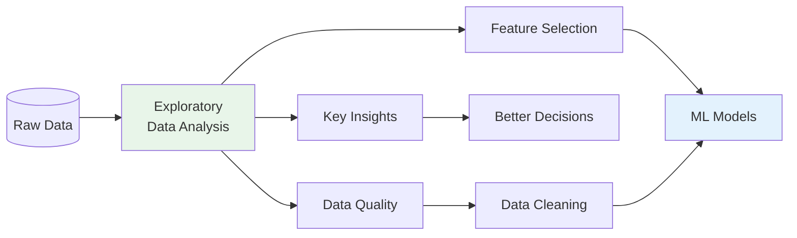
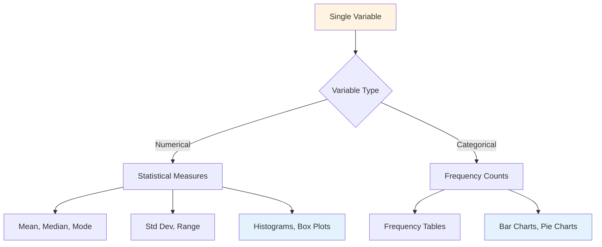
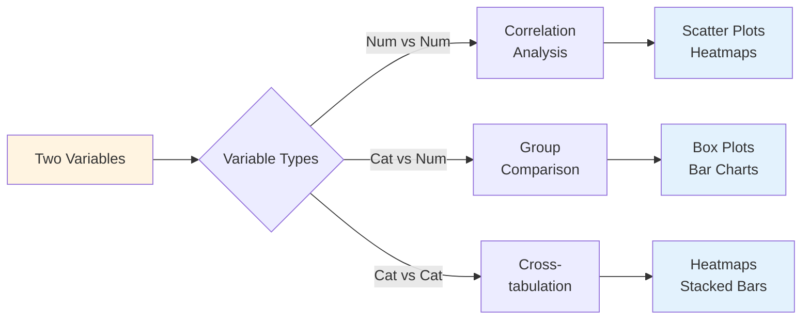
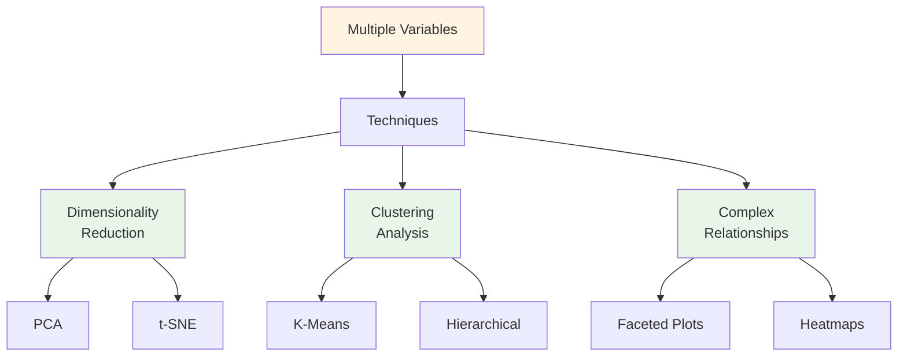
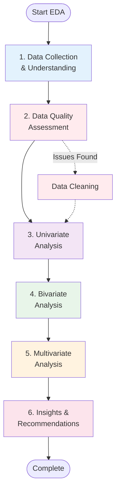
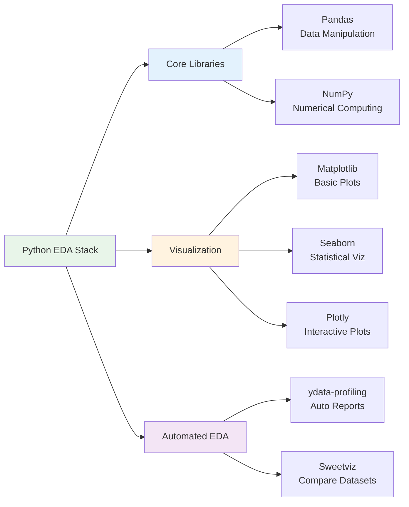
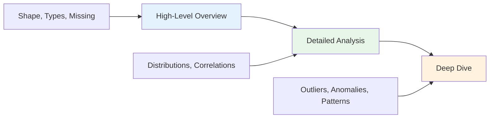

# Exploratory Data Analysis (EDA): A Beginner's Guide

Exploratory Data Analysis (EDA) is a critical step in the data science workflow that involves analyzing datasets to summarize their main characteristics, discover patterns, spot anomalies, and test hypotheses using statistical graphics and visualization methods.

## Table of Contents
- [What is EDA?](#what-is-eda)
- [Why is EDA Important?](#why-is-eda-important)
- [Types of EDA](#types-of-eda)
- [EDA Process Steps](#eda-process-steps)
- [Tools and Libraries](#tools-and-libraries)
- [Getting Started](#getting-started)
- [Best Practices](#best-practices)

## What is EDA?

EDA is the process of:
- **Examining** data before applying machine learning algorithms
- **Visualizing** patterns and relationships in the data
- **Identifying** outliers, missing values, and data quality issues
- **Understanding** the structure and distribution of variables
- **Formulating** hypotheses for further analysis

Think of EDA as "getting to know your data" before making any modeling decisions.

## Why is EDA Important?



**Key Benefits:**
1. **Understand Data Structure**: Know what you're working with
2. **Detect Issues Early**: Find missing values, outliers, errors
3. **Discover Patterns**: Identify trends and relationships
4. **Guide Modeling**: Inform feature selection and algorithm choice
5. **Validate Assumptions**: Test statistical assumptions before modeling

## Types of EDA

### 1. Univariate Analysis

Analyzing **ONE variable** at a time to understand its distribution and characteristics.



**Techniques:**
- **Numerical Variables**: Mean, median, mode, standard deviation, histograms, box plots
- **Categorical Variables**: Frequency tables, bar charts, pie charts

**Example Questions:**
- What is the average sales amount?
- How are products distributed across categories?
- Are there any extreme outliers in prices?

### 2. Bivariate Analysis

Analyzing the relationship between **TWO variables** to find correlations and dependencies.



**Techniques:**
- **Numerical vs Numerical**: Correlation, scatter plots, regression
- **Categorical vs Numerical**: Group means, box plots by category
- **Categorical vs Categorical**: Cross-tabulation, chi-square test

**Example Questions:**
- How does price relate to sales quantity?
- Do weekends have higher sales than weekdays?
- Which product-country combinations perform best?

### 3. Multivariate Analysis

Analyzing relationships among **THREE or more variables** simultaneously.



**Techniques:**
- Multidimensional scatter plots
- Correlation matrices
- Heatmaps with multiple dimensions
- Faceted visualizations
- Principal Component Analysis (PCA)

**Example Questions:**
- How do product, country, and payment method interact?
- What patterns exist across time, geography, and product categories?
- Can we identify customer segments based on multiple features?

## EDA Process Steps

### Step-by-Step Guide



### 1. Data Collection & Understanding

**Objective**: Load and understand your dataset structure

**Tasks:**
- Load data from source (CSV, database, API)
- Check dataset shape (rows � columns)
- Examine data types
- View first/last few records
- Understand memory usage

```python
# Example
df.shape  # (500, 13) - 500 rows, 13 columns
df.dtypes  # Check data types
df.head()  # First 5 records
df.info()  # Summary information
```

### 2. Data Quality Assessment

**Objective**: Identify and handle data quality issues

**Tasks:**
- Detect missing values
- Find duplicate records
- Identify outliers
- Check for inconsistencies
- Calculate data completeness percentage

```python
# Example
df.isnull().sum()  # Count missing values
df.duplicated().sum()  # Count duplicates
```

**Common Issues:**
- Missing values (NaN, None, blank)
- Duplicate records
- Outliers and anomalies
- Inconsistent formatting
- Invalid data types

### 3. Univariate Analysis

**Objective**: Understand each variable individually

**For Numerical Variables:**
- Descriptive statistics (mean, median, std)
- Distribution (histogram, density plot)
- Outlier detection (box plot)

**For Categorical Variables:**
- Frequency distribution
- Mode (most common value)
- Bar charts and pie charts

### 4. Bivariate Analysis

**Objective**: Discover relationships between variable pairs

**Techniques:**
- Correlation analysis
- Scatter plots
- Group comparisons
- Cross-tabulation

### 5. Multivariate Analysis

**Objective**: Identify complex patterns across multiple variables

**Techniques:**
- Correlation matrices
- Faceted plots (multiple subplots)
- Time series with multiple factors
- Heatmaps with multiple dimensions

### 6. Insights & Recommendations

**Objective**: Summarize findings and provide actionable insights

**Deliverables:**
- Key business insights
- Data quality report
- Recommendations for data cleaning
- Suggestions for feature engineering
- Next steps for modeling

## Tools and Libraries

### Python Libraries



**Essential Libraries:**

1. **Pandas**: Data manipulation and analysis
   ```python
   import pandas as pd
   ```

2. **NumPy**: Numerical operations
   ```python
   import numpy as np
   ```

3. **Matplotlib**: Basic plotting
   ```python
   import matplotlib.pyplot as plt
   ```

4. **Seaborn**: Statistical visualization
   ```python
   import seaborn as sns
   ```

5. **Plotly**: Interactive visualizations
   ```python
   import plotly.express as px
   ```

**Automated EDA Tools:**

- **ydata-profiling** (formerly pandas-profiling): Generate comprehensive reports
- **Sweetviz**: Compare datasets visually
- **D-Tale**: Interactive data exploration

## Getting Started

### Prerequisites

```bash
# Install required libraries
pip install pandas numpy matplotlib seaborn

# Optional: For automated EDA
pip install ydata-profiling sweetviz
```

### Running the Demo

```bash
# Run the comprehensive EDA demo
python day2_eda.py
```

**What the demo includes:**
- Sample e-commerce dataset generation (500 records)
- All 6 steps of EDA process
- Visualizations saved as PNG files
- CSV output with analyzed data

### Expected Output

**Console Output:**
- Data understanding summary
- Data quality metrics
- Statistical summaries
- Key insights and recommendations

**Generated Files:**
- `eda_sample_data.csv` - Sample dataset
- `images/univariate_analysis.png` - Single variable plots
- `images/bivariate_analysis.png` - Relationship plots
- `images/multivariate_analysis.png` - Complex pattern plots

## Best Practices

### 1. Start Simple, Then Go Deep



- Begin with basic statistics
- Gradually increase complexity
- Focus on interesting findings

### 2. Visualize Everything

- Use appropriate chart types
- Keep visualizations simple and clear
- Use color meaningfully
- Add labels and titles

**Chart Selection Guide:**

| Data Type | Purpose | Chart Type |
|-----------|---------|-----------|
| Numerical | Distribution | Histogram, Density Plot |
| Numerical | Outliers | Box Plot |
| Categorical | Frequency | Bar Chart, Pie Chart |
| Num vs Num | Relationship | Scatter Plot |
| Cat vs Num | Comparison | Box Plot by Group |
| Time Series | Trends | Line Chart |
| Correlation | Relationships | Heatmap |

### 3. Document Your Findings

- Note interesting patterns
- Record data quality issues
- Save visualizations
- Write summaries
- Create reproducible notebooks

### 4. Iterate and Refine

- EDA is not linear
- Revisit earlier steps as you learn more
- Follow interesting threads
- Ask "why?" when you see patterns

### 5. Focus on Business Value

- Connect findings to business questions
- Prioritize actionable insights
- Consider the audience
- Provide recommendations

## Common EDA Patterns

### Pattern 1: Missing Data Analysis

```python
# Calculate missing percentage
missing_pct = (df.isnull().sum() / len(df)) * 100

# Visualize missing data
import missingno as msno
msno.matrix(df)
```

### Pattern 2: Outlier Detection

```python
# Using IQR method
Q1 = df['column'].quantile(0.25)
Q3 = df['column'].quantile(0.75)
IQR = Q3 - Q1
outliers = df[(df['column'] < Q1 - 1.5 * IQR) | (df['column'] > Q3 + 1.5 * IQR)]
```

### Pattern 3: Correlation Analysis

```python
# Correlation matrix
corr_matrix = df.corr()

# Visualize with heatmap
sns.heatmap(corr_matrix, annot=True, cmap='coolwarm')
```

### Pattern 4: Group Comparisons

```python
# Compare groups
df.groupby('category')['sales'].agg(['mean', 'median', 'count'])
```

## Real-World Example: E-Commerce Analysis

Our demo analyzes a sample e-commerce dataset with:

**Data Fields:**
- Orders (order_id, order_date)
- Products (product, category, unit_price, quantity)
- Customers (customer_id, customer_age, country)
- Transactions (total_amount, payment_method, rating)

**Key Questions Answered:**
1. Which products generate the most revenue?
2. Which countries are the top markets?
3. Do weekend sales differ from weekday sales?
4. What is the relationship between price and quantity?
5. How does customer age affect purchase behavior?

**Insights Discovered:**
- Top-performing products and markets
- Weekend sales patterns
- Price-quantity relationships
- Customer demographic trends
- Payment method preferences

## Comparison: Manual vs Automated EDA

| Aspect | Manual EDA | Automated EDA |
|--------|-----------|---------------|
| **Time** | Hours to days | Minutes |
| **Flexibility** | High - custom analysis | Medium - predefined reports |
| **Learning** | Deep understanding | Quick overview |
| **Customization** | Fully customizable | Limited options |
| **Best For** | In-depth analysis | Initial exploration |
| **Tools** | Pandas, Matplotlib, Seaborn | ydata-profiling, Sweetviz |

**Recommendation**: Start with automated EDA for quick insights, then do manual EDA for deeper analysis.

## Key Takeaways

1. **EDA is Essential**: Never skip it - it saves time and prevents errors later
2. **Understand Before Modeling**: Know your data before applying ML algorithms
3. **Visualize Liberally**: Charts reveal patterns that statistics miss
4. **Iterate**: EDA is exploratory - follow interesting leads
5. **Document**: Keep track of findings for future reference
6. **Think Business**: Connect data patterns to business impact


## Further Learning

### Recommended Resources

- [GeeksforGeeks EDA Tutorial](https://www.geeksforgeeks.org/data-analysis/what-is-exploratory-data-analysis/)
- [Pandas Documentation](https://pandas.pydata.org/docs/)
- [Seaborn Gallery](https://seaborn.pydata.org/examples/index.html)
- [Kaggle EDA Notebooks](https://www.kaggle.com/code)

### Practice Datasets

- **Kaggle**: Thousands of datasets for practice
- **UCI ML Repository**: Classic datasets
- **data.gov**: Government open data
- **Google Dataset Search**: Find datasets across the web

### Next Steps

1. Practice with the provided demo code
2. Analyze your own datasets
3. Participate in Kaggle competitions
4. Build an EDA portfolio
5. Learn feature engineering
6. Progress to machine learning
