# Data Wrangling: A Beginner's Guide

Data wrangling (also known as data munging) is the process of transforming raw data into a clean, structured format that's ready for analysis. Think of it as "preparing ingredients before cooking" - you need to clean, chop, and organize everything before you can create a great dish.

## Table of Contents
- [What is Data Wrangling?](#what-is-data-wrangling)
- [Why is Data Wrangling Important?](#why-is-data-wrangling-important)
- [Data Wrangling Process](#data-wrangling-process)
- [Common Data Wrangling Tasks](#common-data-wrangling-tasks)
- [Tools and Techniques](#tools-and-techniques)
- [Best Practices](#best-practices)
- [Getting Started](#getting-started)

## What is Data Wrangling?

Data wrangling is the process of:
- **Cleaning** messy, inconsistent data
- **Transforming** data into the right format
- **Enriching** data with additional information
- **Validating** data quality and accuracy
- **Preparing** data for analysis or machine learning

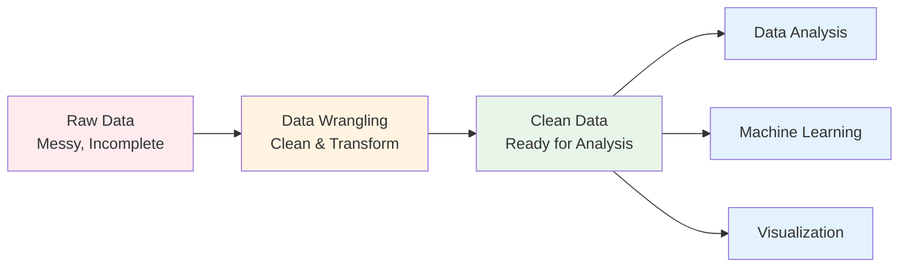

## Why is Data Wrangling Important?

### The Reality of Real-World Data

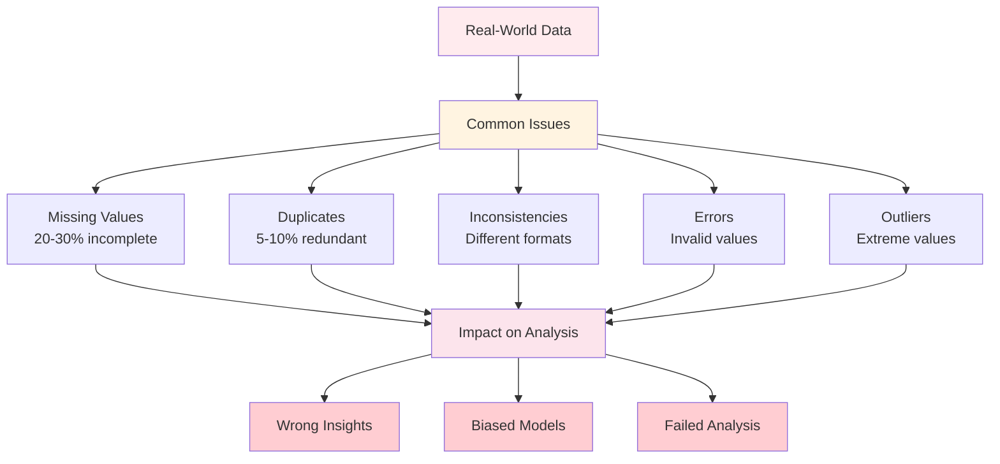

**Key Statistics:**
- Data scientists spend **60-80%** of their time on data wrangling
- Poor data quality costs organizations an average of **$15 million** per year
- **Only 3%** of data meets basic quality standards without wrangling

**Benefits of Data Wrangling:**
1. **Accuracy**: Clean data leads to accurate insights
2. **Efficiency**: Structured data speeds up analysis
3. **Reliability**: Validated data ensures trustworthy results
4. **Compliance**: Proper data handling meets regulations
5. **Decision-Making**: Quality data enables better decisions

## Data Wrangling Process

### The 4-Step Framework

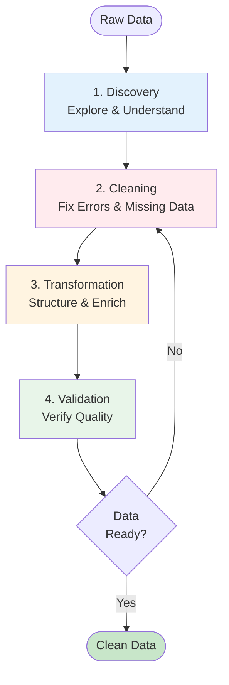

### Step 1: Discovery

**Objective**: Understand what you're working with

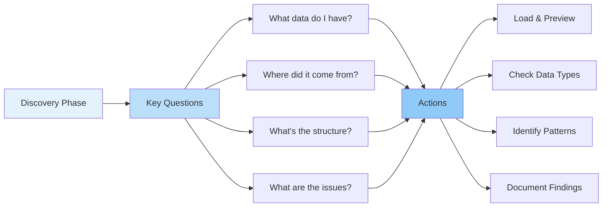

**Tasks:**
- Load data from various sources
- Examine first/last records
- Check dimensions (rows � columns)
- Identify data types
- Look for obvious issues

**Example Insights:**
- "This dataset has 10,000 rows and 15 columns"
- "The 'date' column is stored as text, not dates"
- "About 20% of 'age' values are missing"

### Step 2: Cleaning

**Objective**: Fix errors and handle missing data

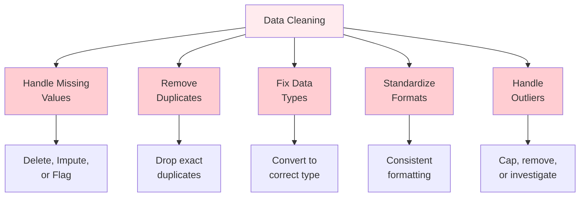

**Common Cleaning Tasks:**

| Issue | Solution | Example |
|-------|----------|---------|
| Missing Values | Impute with mean/median/mode | Fill age with median age |
| Duplicates | Remove identical rows | Keep first occurrence |
| Wrong Types | Convert to correct type | "123" � 123 |
| Inconsistent Format | Standardize | "USA", "US", "United States" � "US" |
| Outliers | Cap or remove | Age = 999 � remove |

### Step 3: Transformation

**Objective**: Structure and enrich data for analysis

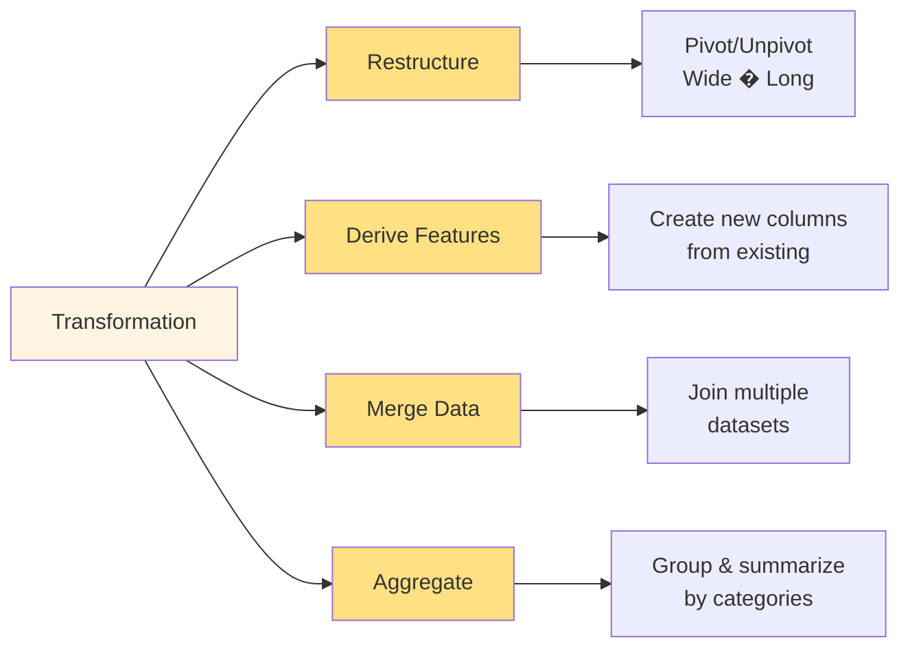

**Transformation Types:**

**1. Feature Engineering**
- Create age groups from age (18-25, 26-35, etc.)
- Extract month/day from dates
- Calculate ratios (revenue/cost)

**2. Data Reshaping**
- Pivot: Long format � Wide format
- Melt: Wide format � Long format
- Stack/Unstack operations

**3. Data Merging**
- Join datasets on common keys
- Concatenate similar datasets
- Combine horizontal/vertical

**4. Aggregation**
- Group by categories (product, region)
- Calculate summaries (sum, mean, count)
- Time-based aggregation (daily � monthly)

### Step 4: Validation

**Objective**: Verify data quality and correctness

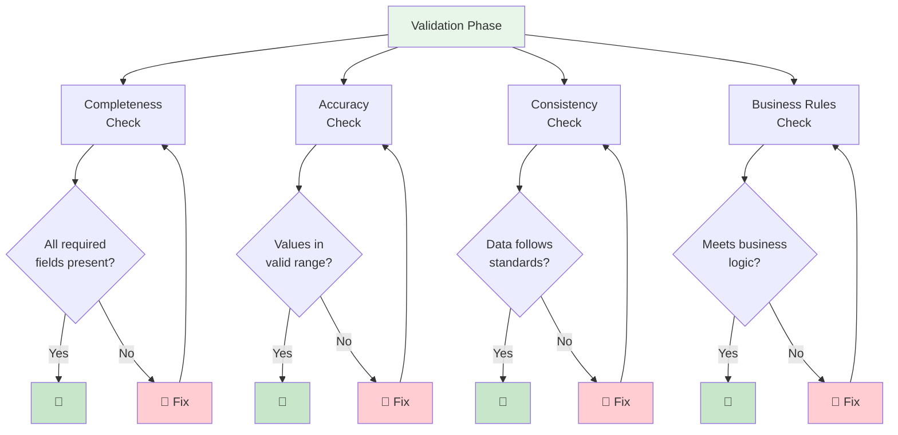

**Validation Checks:**

1. **Completeness**: No missing critical values
2. **Accuracy**: Values within expected ranges
3. **Consistency**: Formats match standards
4. **Uniqueness**: No unexpected duplicates
5. **Integrity**: Relationships preserved

## Common Data Wrangling Tasks

### 1. Handling Missing Values

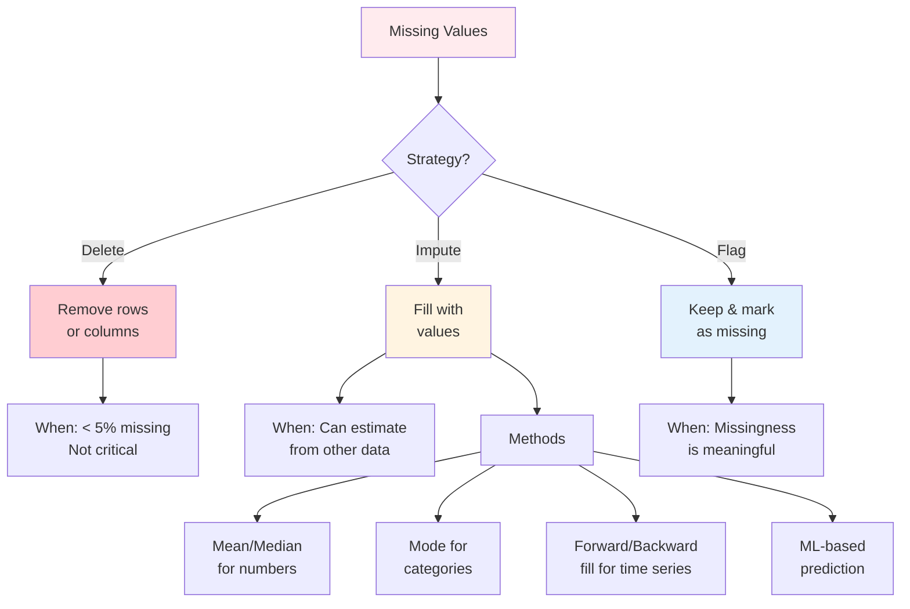

**Decision Guide:**
- **< 5% missing**: Usually safe to delete
- **5-40% missing**: Consider imputation
- **> 40% missing**: Might need to drop column or collect more data

### 2. Removing Duplicates

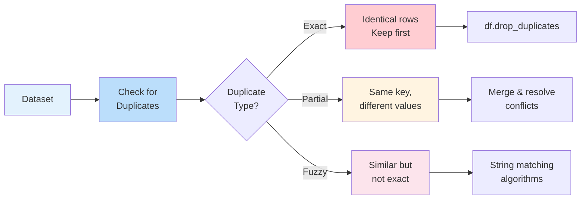

### 3. Data Type Conversion

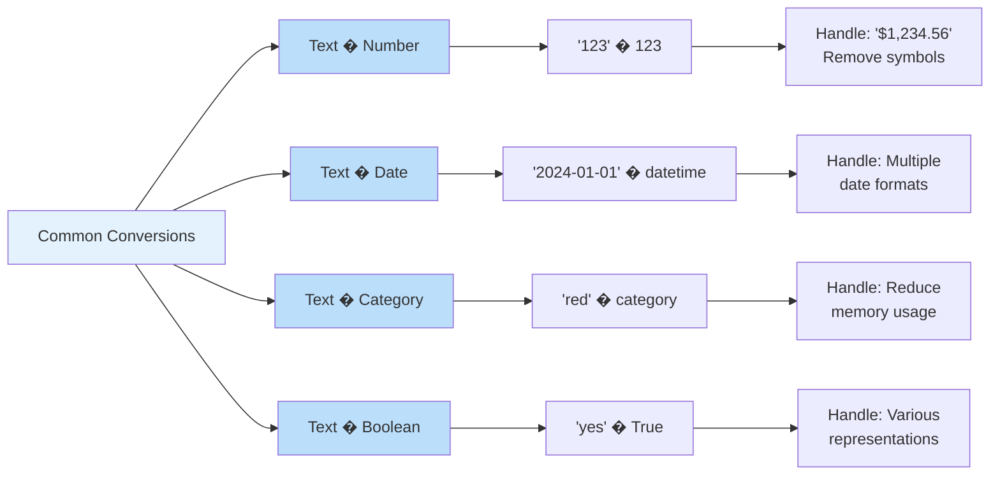

### 4. Standardization & Normalization

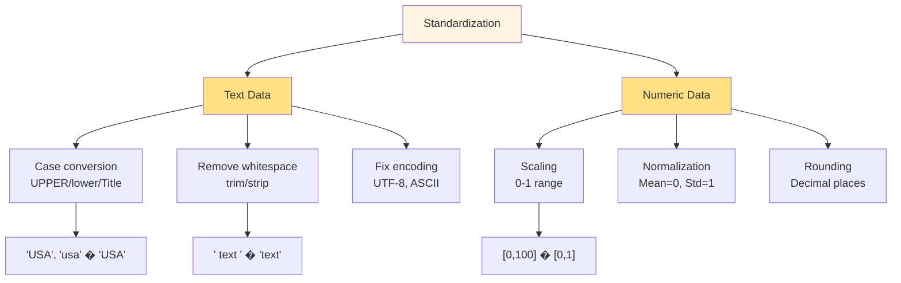

### 5. Feature Engineering

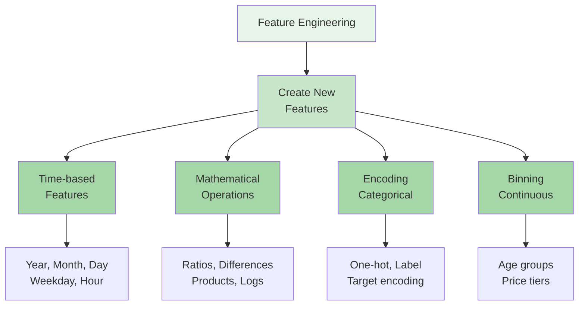

## Tools and Techniques

### Python Libraries for Data Wrangling

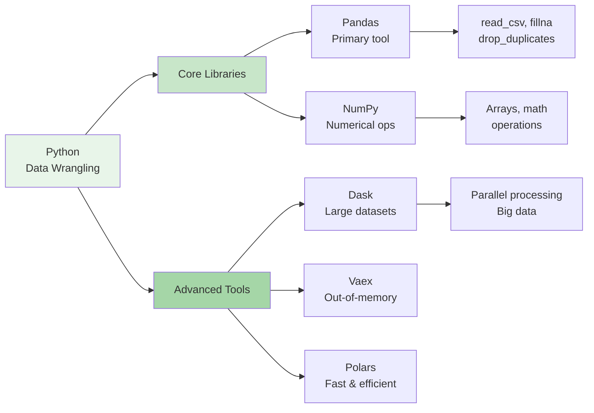

### Essential Pandas Operations

| Task | Pandas Method | Example |
|------|--------------|---------|
| **Load Data** | `pd.read_csv()` | `df = pd.read_csv('data.csv')` |
| **Preview** | `.head()`, `.tail()` | `df.head(10)` |
| **Info** | `.info()`, `.describe()` | `df.info()` |
| **Missing** | `.isnull()`, `.fillna()` | `df.fillna(0)` |
| **Duplicates** | `.drop_duplicates()` | `df.drop_duplicates()` |
| **Filter** | Boolean indexing | `df[df['age'] > 18]` |
| **Select** | `.loc[]`, `.iloc[]` | `df.loc[:, ['name', 'age']]` |
| **Group** | `.groupby()` | `df.groupby('category').mean()` |
| **Merge** | `.merge()`, `.join()` | `pd.merge(df1, df2, on='id')` |
| **Reshape** | `.pivot()`, `.melt()` | `df.pivot(index='date', columns='product')` |

### Data Wrangling Workflow

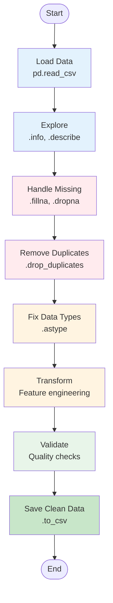

## Best Practices

### 1. Document Your Process

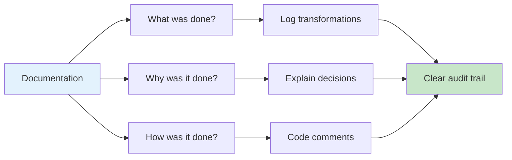

**Best Practices:**
- Comment your code explaining WHY, not just WHAT
- Keep a log of data quality issues found
- Document assumptions and decisions
- Version control your scripts

### 2. Validate at Every Step

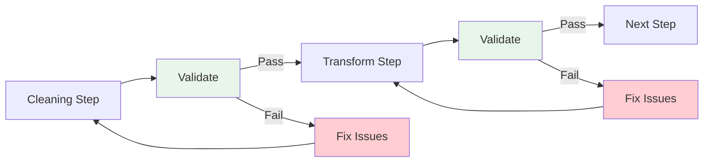

**Validation Checklist:**
-  Check data shape before/after
-  Verify no unexpected nulls introduced
-  Confirm data types are correct
-  Test with sample calculations
-  Compare totals/counts

### 3. Handle Edge Cases

**Common Edge Cases:**
- Empty strings vs. null values
- Leading/trailing whitespace
- Different date formats
- Special characters in text
- Numeric values as strings
- Zero vs. null vs. missing

### 4. Keep Raw Data Unchanged

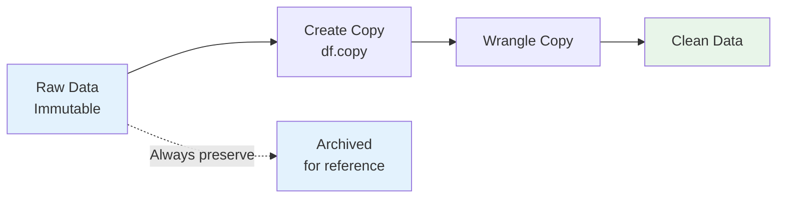

**Why?**
- Allows reprocessing if needed
- Enables comparison with original
- Maintains data lineage
- Supports auditability

### 5. Automate Repetitive Tasks

```python
# Create reusable functions
def clean_dataframe(df):
    """Standard cleaning pipeline"""
    df = df.copy()
    df = handle_missing(df)
    df = remove_duplicates(df)
    df = fix_data_types(df)
    df = standardize_formats(df)
    return df
```

## Getting Started

### Prerequisites

```bash
# Install required libraries
pip install pandas numpy matplotlib seaborn

# Optional: For larger datasets
pip install dask vaex polars
```

### Running the Demo

```bash
# Run the comprehensive data wrangling demo
python day3_data_wrangling.py
```

**What the demo includes:**
- Sample messy dataset generation
- All 4 steps of data wrangling process
- Common wrangling tasks demonstrated
- Before/after comparisons
- Quality metrics reporting

### Expected Output

**Console Output:**
- Data discovery insights
- Cleaning operations performed
- Transformation summaries
- Validation results
- Quality improvement metrics

**Generated Files:**
- `raw_data.csv` - Original messy data
- `clean_data.csv` - Wrangled clean data
- `wrangling_report.txt` - Process documentation

## Real-World Example: E-Commerce Data

### Before Wrangling

```
| order_id | customer | product  | price    | date       | quantity |
|----------|----------|----------|----------|------------|----------|
| 1        | john doe | laptop   | $1,200   | 01/15/2024 | 1        |
| 2        | JANE DOE | Phone    | 800.00   | 2024-01-16 | 2        |
| 1        | john doe | laptop   | $1,200   | 01/15/2024 | 1        |
| 3        |          | tablet   | NULL     | 15-01-2024 |          |
```

**Issues:**
- Inconsistent name formatting (case, spaces)
- Multiple date formats
- Price has symbols and inconsistent format
- Missing values (customer, quantity)
- Duplicate rows
- Null values in critical fields

### After Wrangling

```
| order_id | customer | product | price  | date       | quantity | revenue |
|----------|----------|---------|--------|------------|----------|---------|
| 1        | John Doe | Laptop  | 1200.0 | 2024-01-15 | 1        | 1200.0  |
| 2        | Jane Doe | Phone   | 800.0  | 2024-01-16 | 2        | 1600.0  |
```

**Improvements:**
-  Standardized name format (Title Case)
-  Unified date format (YYYY-MM-DD)
-  Clean numeric prices
-  Removed duplicates
-  Handled missing values
-  Added derived column (revenue)

## Key Takeaways

1. **Data wrangling is essential** - 60-80% of data science time
2. **Follow a systematic process** - Discovery � Clean � Transform � Validate
3. **Document everything** - Maintain audit trail
4. **Validate continuously** - Check at every step
5. **Automate when possible** - Reusable functions for common tasks
6. **Keep raw data safe** - Never modify originals
7. **Think about edge cases** - Handle unexpected inputs


## Further Learning

### Recommended Resources

- [DataCamp: What is Data Wrangling?](https://www.datacamp.com/blog/what-is-data-wrangling)
- [Pandas Documentation](https://pandas.pydata.org/docs/)
- [Python Data Science Handbook](https://jakevdp.github.io/PythonDataScienceHandbook/)
- [Real Python - Pandas Tutorials](https://realpython.com/learning-paths/pandas-data-science/)

### Practice Datasets

- **Kaggle**: Real-world messy datasets
- **Data.gov**: Government open data
- **UCI ML Repository**: Classic datasets with quality issues
- **Your own data**: Practice with real problems

### Next Steps

1. Practice with the provided demo code
2. Work through the exercises
3. Apply to your own datasets
4. Build a data wrangling toolkit
5. Learn data validation frameworks
6. Progress to ETL and data pipelines

---
