# Data Labeling: A Beginner's Guide

Data labeling is the process of identifying and tagging data samples to provide context and meaning for machine learning models. Think of it as "teaching by example" - you show the model what things are by labeling them, so it can learn to recognize similar patterns on its own.

## Table of Contents
- [What is Data Labeling?](#what-is-data-labeling)
- [Why is Data Labeling Necessary for AI?](#why-is-data-labeling-necessary-for-ai)
- [Types of Data Labeling](#types-of-data-labeling)
- [Data Labeling Techniques](#data-labeling-techniques)
- [Data Labeling Workflow](#data-labeling-workflow)
- [Challenges and Solutions](#challenges-and-solutions)
- [Best Practices](#best-practices)
- [Getting Started](#getting-started)

## What is Data Labeling?

Data labeling (also called data annotation) is the process of adding meaningful tags or labels to raw data to make it understandable for machine learning algorithms.

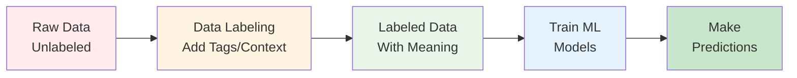

### Real-World Analogy

Imagine teaching a child to identify fruits:
- **Raw Data**: Pictures of various objects
- **Labeling**: You point and say "This is an apple", "This is a banana"
- **Labeled Data**: Pictures now have names attached
- **Learning**: Child learns patterns (red, round = apple)
- **Prediction**: Child can now identify apples they've never seen before

## Why is Data Labeling Necessary for AI?

### The Foundation of Supervised Learning

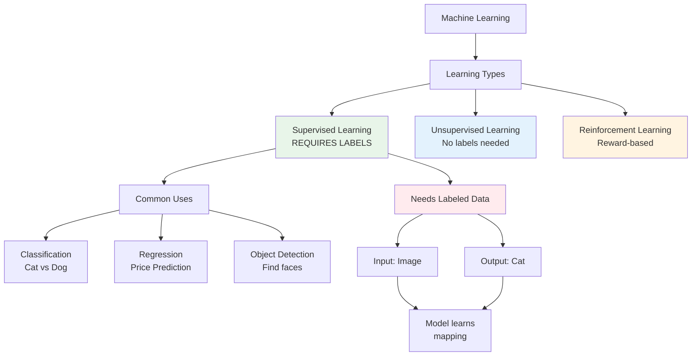

**Why Labels Matter:**

1. **Supervised Learning Requirement**: 80% of ML models use supervised learning
2. **Pattern Recognition**: Models learn from labeled examples
3. **Accuracy**: Better labels = more accurate models
4. **Context**: Provides meaning to raw data
5. **Validation**: Labeled data validates model performance

### Impact on Model Performance

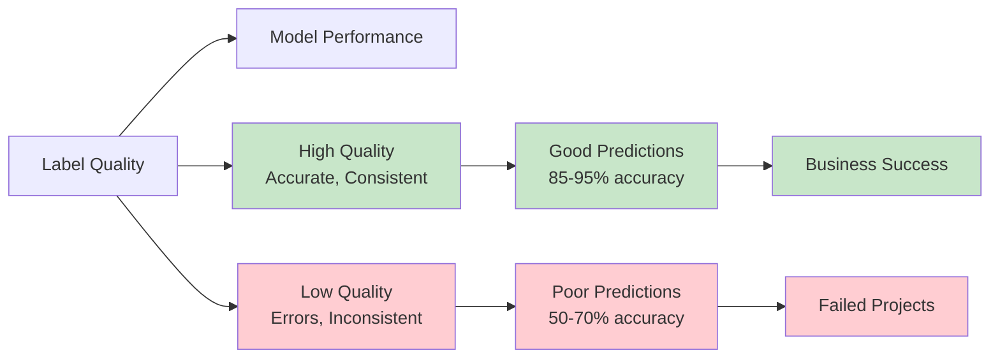

**Statistics:**
- **High-quality labels** can improve model accuracy by **30-40%**
- **Inconsistent labeling** can reduce accuracy by **20-30%**
- **70-80%** of AI project time is spent on data preparation and labeling

## Types of Data Labeling

### 1. Image Labeling

Adding tags to images to identify objects, patterns, or features.

```mermaid
graph TB
    Image[Image Labeling] --> Types[Types]

    Types --> Classification[Image Classification<br/>Whole image label]
    Types --> Detection[Object Detection<br/>Bounding boxes]
    Types --> Segmentation[Semantic Segmentation<br/>Pixel-level masks]
    Types --> Keypoint[Keypoint Annotation<br/>Specific points]

    Classification --> Ex1["Dog" or "Cat"]
    Detection --> Ex2[Box around person]
    Segmentation --> Ex3[Outline every pixel]
    Keypoint --> Ex4[Face landmarks]

    style Image fill:#e3f2fd
    style Classification fill:#bbdefb
    style Detection fill:#bbdefb
    style Segmentation fill:#bbdefb
    style Keypoint fill:#bbdefb
```

**Common Use Cases:**
- **Image Classification**: Email spam detection, medical diagnosis
- **Object Detection**: Self-driving cars, security cameras
- **Segmentation**: Medical imaging, satellite imagery
- **Keypoints**: Face recognition, pose estimation

**Example:**
```
Input: Photo of a street scene
Labels:
  - Bounding box around car: "vehicle"
  - Bounding box around person: "pedestrian"
  - Bounding box around sign: "stop sign"
```

### 2. Text Labeling

Annotating text data with categories, entities, or sentiments.

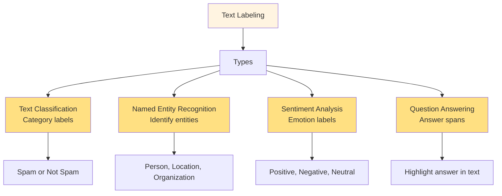

**Common Use Cases:**
- **Classification**: Spam filtering, topic categorization
- **NER**: Information extraction, chatbots
- **Sentiment**: Social media monitoring, customer feedback
- **QA**: Virtual assistants, search engines

**Example:**
```
Text: "Apple released the iPhone 15 in Cupertino."
Labels:
  - "Apple" � Organization
  - "iPhone 15" � Product
  - "Cupertino" � Location
```

### 3. Audio Labeling

Annotating audio data with transcriptions or classifications.

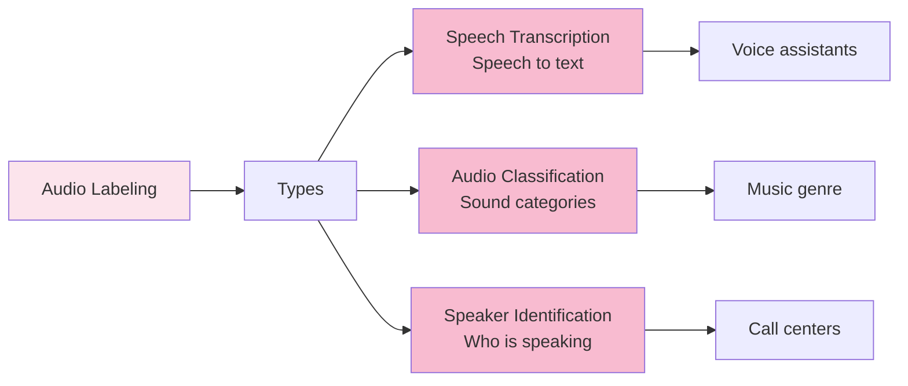

**Common Use Cases:**
- **Transcription**: Virtual assistants (Siri, Alexa), subtitles
- **Classification**: Music recommendations, sound detection
- **Speaker ID**: Security systems, call routing

### 4. Video Labeling

Annotating video content frame-by-frame or as sequences.

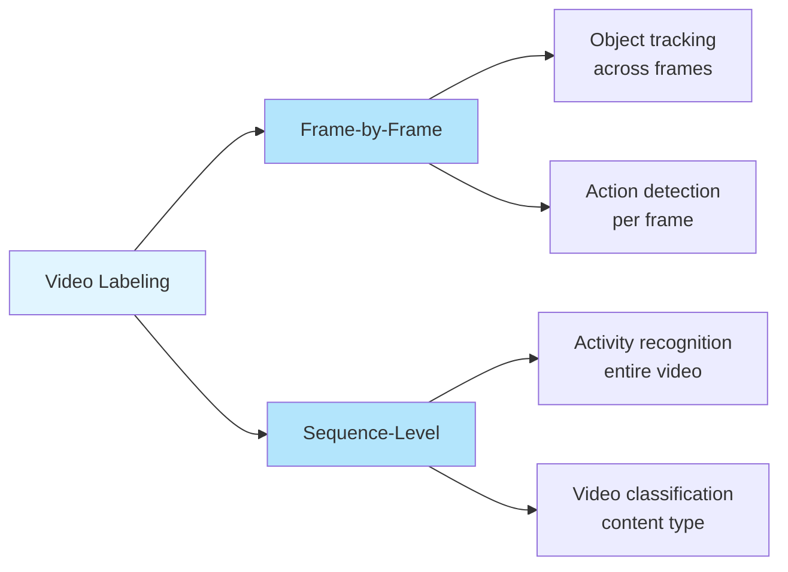

**Common Use Cases:**
- **Action Recognition**: Sports analysis, surveillance
- **Object Tracking**: Traffic monitoring, wildlife tracking
- **Event Detection**: Security systems, content moderation

## Data Labeling Techniques

### Manual vs Automated vs Hybrid

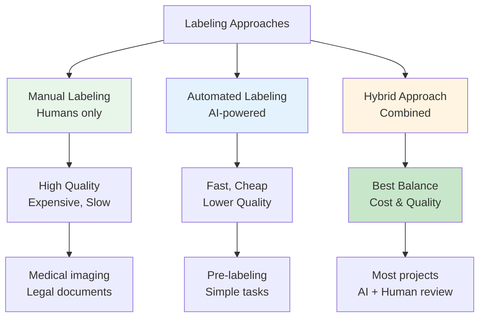

### Comparison Table

| Approach | Speed | Cost | Quality | Best For |
|----------|-------|------|---------|----------|
| **Manual** | Slow | High | Highest | Complex, critical tasks |
| **Automated** | Fast | Low | Variable | Simple, large-scale |
| **Hybrid** | Medium | Medium | High | Most real-world projects |

### 1. Manual Labeling

**Process:**
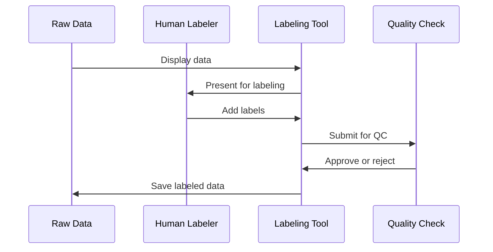

**Pros:**
- Highest accuracy
- Handles complex cases
- Contextual understanding

**Cons:**
- Time-consuming
- Expensive at scale
- Human bias and fatigue

### 2. Automated Labeling

**Process:**
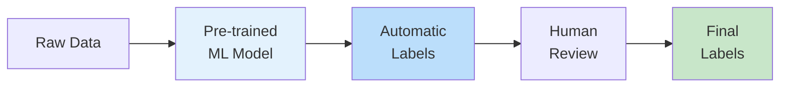

**Techniques:**
- **Pre-trained Models**: Use existing models (BERT, GPT, ResNet)
- **Transfer Learning**: Adapt models from similar tasks
- **Active Learning**: Model identifies uncertain samples for human review
- **Weak Supervision**: Use rules and heuristics

**Pros:**
- Fast and scalable
- Cost-effective
- Consistent

**Cons:**
- Requires initial labeled data
- May propagate errors
- Less accurate for edge cases

### 3. Hybrid Approach (Recommended)

**Workflow:**
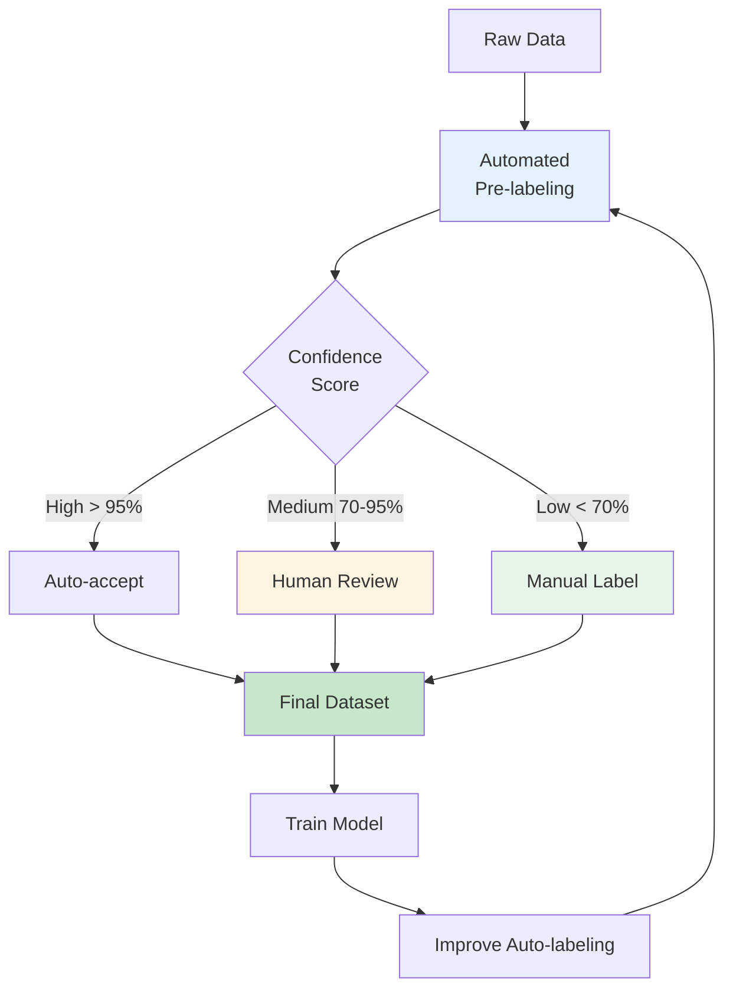

**Best Practice Flow:**
1. Start with automated pre-labeling (if possible)
2. High-confidence labels auto-accepted
3. Low-confidence labels reviewed by humans
4. Edge cases manually labeled
5. Continuous improvement cycle

## Data Labeling Workflow

### End-to-End Process

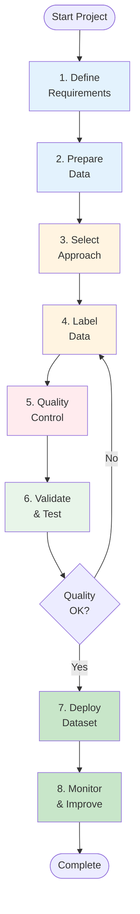

### Step-by-Step Guide

**1. Define Requirements**
- What type of labels do you need?
- How many samples to label?
- What accuracy is required?
- Budget and timeline?

**2. Prepare Data**
- Collect raw data
- Clean and organize
- Sample for pilot testing
- Set up storage infrastructure

**3. Select Labeling Approach**
- Manual, automated, or hybrid?
- In-house or outsource?
- Choose labeling tools
- Define guidelines

**4. Label Data**
- Train labelers
- Pilot test with small batch
- Scale up production
- Track progress

**5. Quality Control**
- Inter-annotator agreement
- Random sampling checks
- Resolve disagreements
- Continuous monitoring

**6. Validate & Test**
- Split data (train/validation/test)
- Measure label quality metrics
- Test with model training
- Iterate if needed

**7. Deploy Dataset**
- Version control
- Document metadata
- Store securely
- Make accessible to team

**8. Monitor & Improve**
- Track model performance
- Identify edge cases
- Add new labels as needed
- Continuous improvement

## Challenges and Solutions

### Common Challenges

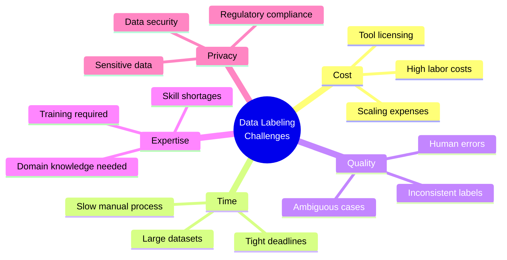

### Solutions and Best Practices

| Challenge | Solution | Implementation |
|-----------|----------|----------------|
| **High Cost** | Hybrid approach, crowdsourcing | Use AI pre-labeling + human review |
| **Time-Consuming** | Automated pre-labeling | Start with pre-trained models |
| **Inconsistency** | Clear guidelines, training | Detailed labeling instructions |
| **Quality Issues** | Multi-annotator consensus | 3+ labelers per sample, majority vote |
| **Domain Expertise** | Expert review, specialized teams | Medical/legal experts for complex data |
| **Scalability** | Distributed teams, automation | Cloud-based platforms, APIs |
| **Bias** | Diverse labelers, audits | Multiple demographics, regular checks |
| **Privacy** | Anonymization, secure platforms | Encryption, access controls |

### Quality Assurance Framework

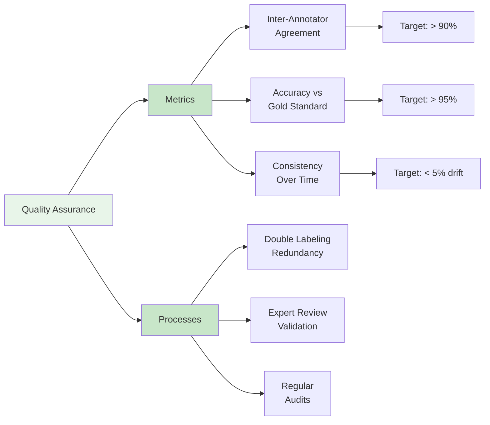

## Best Practices

### 1. Create Clear Labeling Guidelines

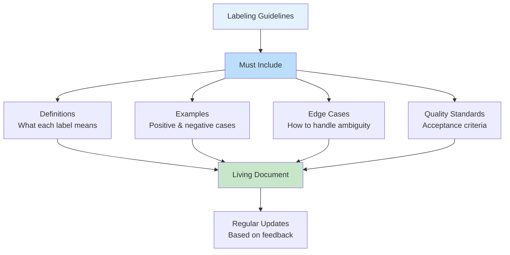

**Guidelines Should Include:**
- Clear definitions for each label
- Visual examples (good and bad)
- Decision trees for ambiguous cases
- Quality criteria and standards
- FAQs from labelers

### 2. Implement Quality Control

**Multi-Layer QC:**
1. **Self-review**: Labeler checks own work
2. **Peer review**: Another labeler reviews
3. **Expert review**: Domain expert validates
4. **Automated checks**: Scripts catch obvious errors

### 3. Use Appropriate Tools

**Popular Labeling Tools:**
- **Label Studio**: Open-source, multi-modal
- **Labelbox**: Enterprise platform
- **Amazon SageMaker Ground Truth**: AWS integrated
- **SuperAnnotate**: AI-powered
- **Prodigy**: Active learning focused

### 4. Start Small, Scale Gradually

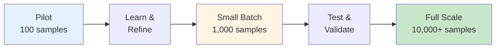

### 5. Monitor and Iterate

**Continuous Improvement Cycle:**
1. Track labeling metrics
2. Identify problem areas
3. Update guidelines
4. Retrain labelers
5. Re-label problematic samples
6. Repeat

## Getting Started

### Prerequisites

```bash
# Install common labeling libraries
pip install pandas numpy pillow opencv-python

# Optional: Install labeling tools
pip install label-studio scikit-learn
```

### Quick Start Guide

**1. Small Project Setup:**
```python
# Define your labels
labels = ["cat", "dog", "bird"]

# Prepare your data
import os
images = os.listdir("data/images")

# Create annotation file
annotations = []
for img in images:
    # Manual labeling or use tool
    label = get_label(img)  # Your labeling function
    annotations.append({"image": img, "label": label})
```

**2. Quality Check:**
```python
# Calculate inter-annotator agreement
from sklearn.metrics import cohen_kappa_score

# Compare two labelers
agreement = cohen_kappa_score(labeler1, labeler2)
print(f"Agreement: {agreement:.2%}")  # Target: > 80%
```

### Learning Path

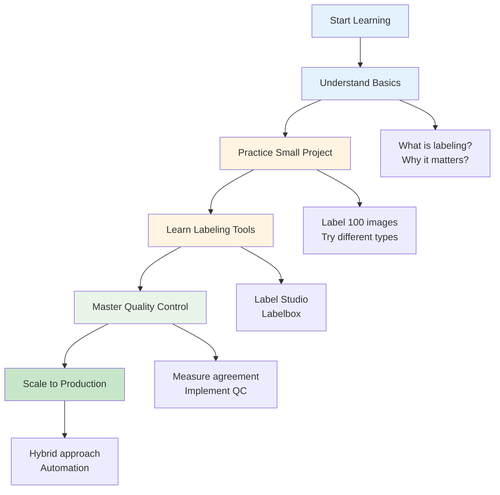

## Real-World Applications

### Industry Use Cases

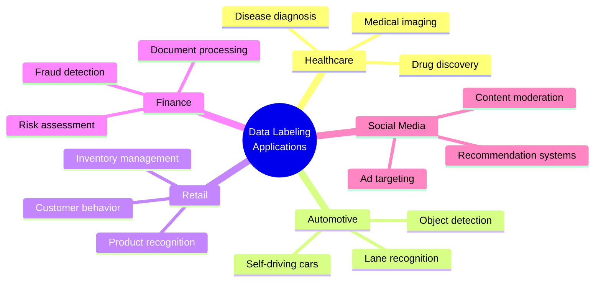

### Success Metrics

| Metric | Description | Target |
|--------|-------------|--------|
| **Accuracy** | % of correct labels | > 95% |
| **Consistency** | Inter-annotator agreement | > 85% |
| **Coverage** | % of data labeled | 100% required |
| **Speed** | Samples per hour | Varies by type |
| **Cost** | $ per sample | Project dependent |

## Key Takeaways

1. **Data labeling is essential** - Foundation of supervised ML (80% of models)
2. **Quality matters most** - Better labels = better models
3. **Hybrid approach recommended** - Combine automation with human expertise
4. **Clear guidelines crucial** - Reduces errors and inconsistency
5. **Continuous QC required** - Monitor and improve constantly
6. **Start small, scale gradually** - Pilot � iterate � scale
7. **Choose right tools** - Invest in proper labeling platforms

## Further Learning

### Recommended Resources

- [DataCamp: What is Data Labeling?](https://www.datacamp.com/tutorial/what-is-data-labeling-and-why-is-it-necessary-for-ai)
- [DataCamp: Data Annotation](https://www.datacamp.com/blog/data-annotation)
- [Label Studio Documentation](https://labelstud.io/guide/)
- [Google Cloud AutoML](https://cloud.google.com/automl/docs)

### Practice Datasets

- **Image**: CIFAR-10, ImageNet (pre-labeled for practice)
- **Text**: IMDb reviews, AG News
- **Audio**: LibriSpeech, Common Voice
- **Video**: Kinetics, AVA

### Next Steps

1. Try Label Studio with sample data
2. Label 100 samples manually to understand the process
3. Calculate inter-annotator agreement
4. Experiment with pre-trained models for auto-labeling
5. Build a small ML model with your labeled data
6. Learn active learning techniques
7. Explore advanced annotation strategies

---

*This is an educational guide for understanding data labeling fundamentals in machine learning and AI projects. The principles apply across all ML platforms and use cases.*
