# Model Training: A Beginner's Guide

Model training is the process of "teaching" a machine learning model to optimize its performance on a dataset of sample tasks. It's the most critical step in the AI lifecycle where the model learns by adjusting parameters to produce accurate outputs.

## Table of Contents
- [What is Model Training?](#what-is-model-training)
- [Models vs Algorithms](#models-vs-algorithms)
- [The Training Process](#the-training-process)
- [Types of Learning](#types-of-learning)
- [Training Lifecycle](#training-lifecycle)
- [Key Concepts](#key-concepts)
- [Best Practices](#best-practices)
- [Common Challenges](#common-challenges)
- [Tools and Platforms](#tools-and-platforms)

## What is Model Training?

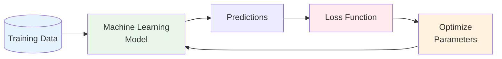

**Model training** is an iterative process where:
- The model learns patterns from training data
- Parameters (weights and biases) are adjusted to minimize errors
- Performance improves through repeated cycles
- The goal is to generalize well to new, unseen data

**Key Components:**
- **Training Data**: Sample datasets representative of real-world use cases
- **Parameters**: Mathematical values (weights and biases) that the model adjusts
- **Loss Function**: Measures how far predictions are from actual results
- **Optimization**: Process of adjusting parameters to reduce loss

## Models vs Algorithms

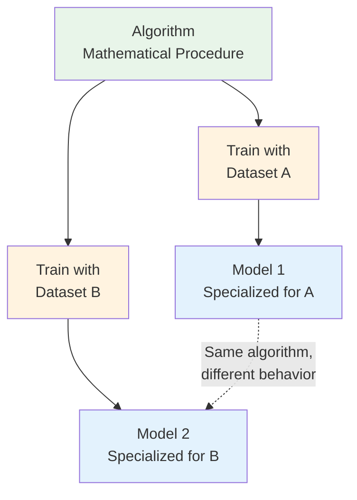

**Important Distinction:**

| Aspect | Algorithm | Model |
|--------|-----------|-------|
| **Definition** | Mathematical procedure for predictions | Trained instance of an algorithm |
| **Nature** | Static, unchanging formula | Dynamic, data-specific |
| **Example** | Linear regression formula | Linear regression trained on house prices |
| **Uniqueness** | Same for all applications | Different for each training dataset |

**Analogy**: An algorithm is like a recipe, while a model is like a dish cooked using that recipe with specific ingredients.

## The Training Process

### Complete Training Workflow

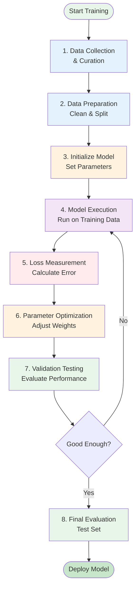

### Step-by-Step Breakdown

#### 1. Data Collection & Curation

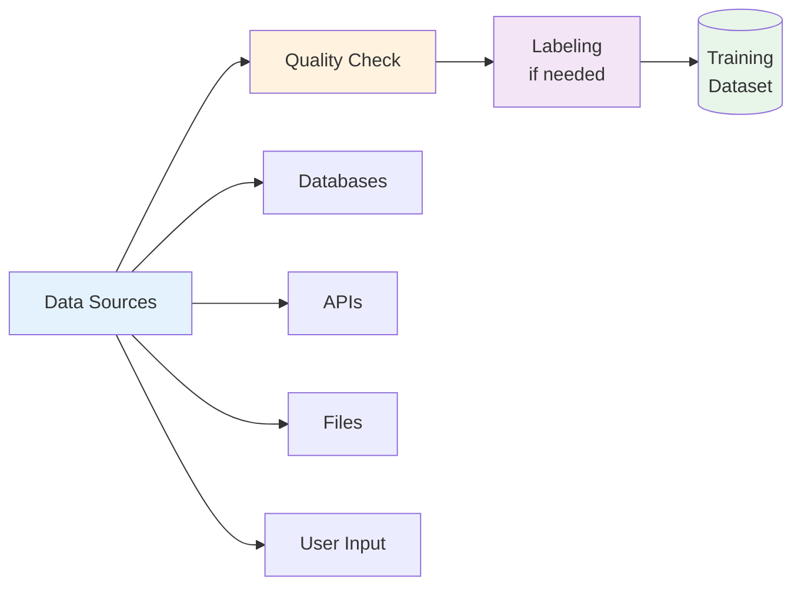

**Tasks:**
- Gather representative data samples
- Ensure data quality and completeness
- Create labeled datasets for supervised learning
- Balance dataset to avoid bias

#### 2. Data Preparation

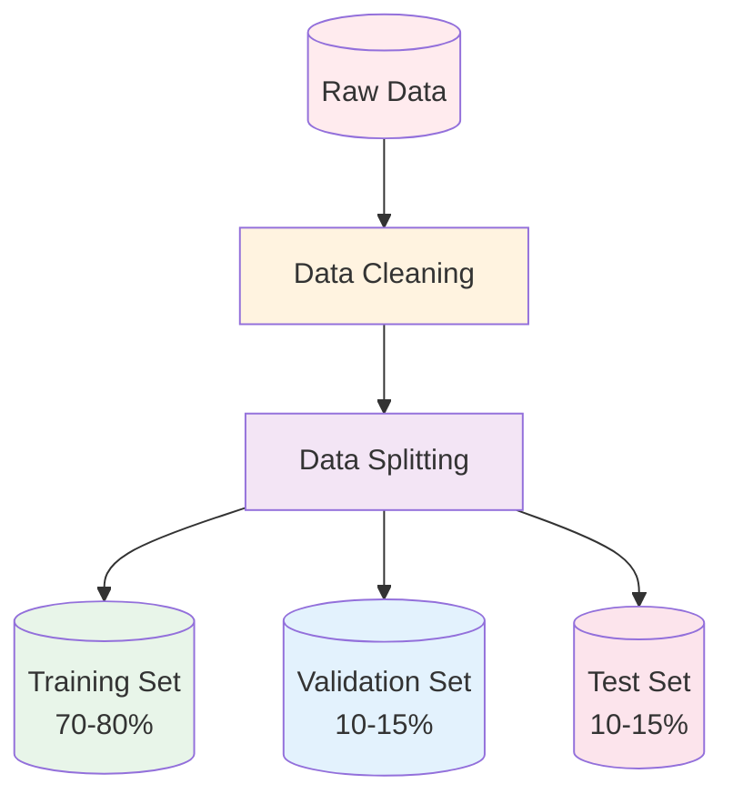

**Data Split Purpose:**
- **Training Set**: Used to train the model
- **Validation Set**: Tune hyperparameters and prevent overfitting
- **Test Set**: Final evaluation on completely unseen data

#### 3-6. The Training Loop

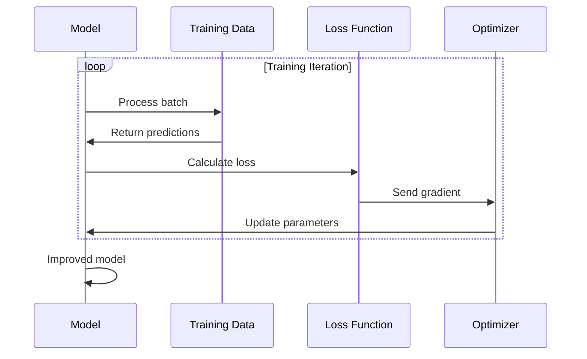

**The Iterative Cycle:**
1. **Execute**: Model processes training data
2. **Measure**: Loss function quantifies errors
3. **Optimize**: Parameters adjusted to reduce loss
4. **Repeat**: Process continues until convergence

#### 7-8. Validation & Testing

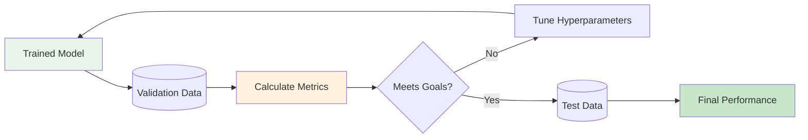

## Types of Learning

### Overview

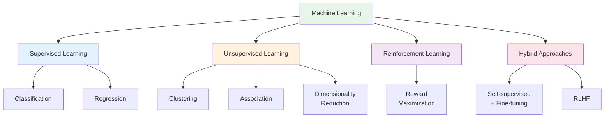

### 1. Supervised Learning

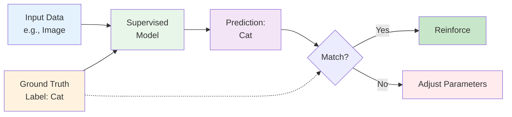

**Definition**: Training models to predict correct outputs against known ground truth labels.

**Characteristics:**
- Requires labeled data (input-output pairs)
- Learns mapping from inputs to outputs
- Dominates state-of-the-art deep learning
- Used for classification and regression

**Common Applications:**

| Task Type | Description | Example |
|-----------|-------------|---------|
| **Classification** | Categorize inputs | Email spam detection |
| **Regression** | Predict continuous values | House price prediction |
| **Object Detection** | Identify and locate objects | Self-driving car vision |
| **Sentiment Analysis** | Determine emotional tone | Product review analysis |

**Example Workflow:**

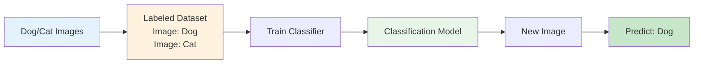

### 2. Unsupervised Learning

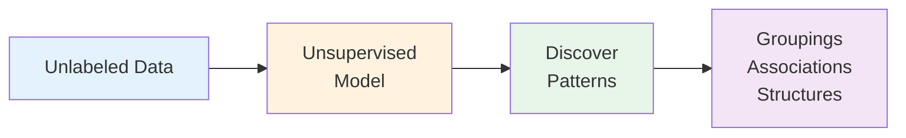

**Definition**: Discovering intrinsic patterns in unlabeled data without ground truth.

**Key Categories:**

#### Clustering

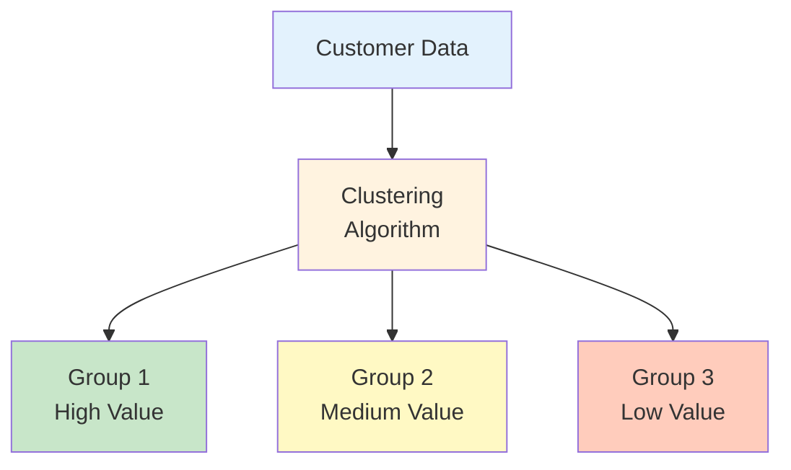

**Use Cases:**
- Customer segmentation
- Image compression
- Anomaly detection

#### Association

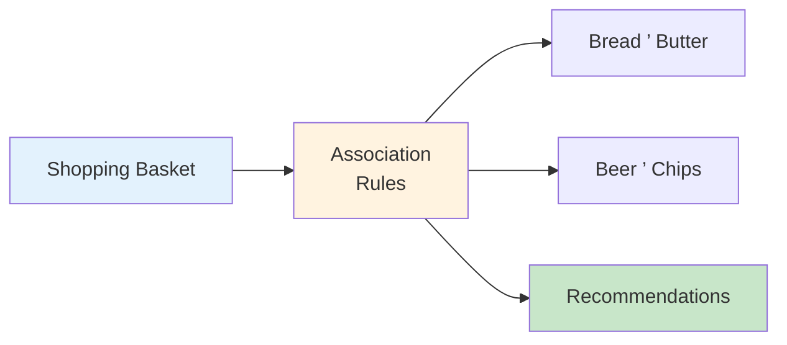

**Use Cases:**
- Market basket analysis
- Recommendation systems
- Product placement

#### Dimensionality Reduction

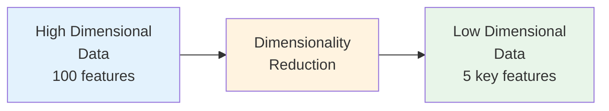

**Use Cases:**
- Feature extraction
- Data visualization
- Noise reduction

### 3. Reinforcement Learning

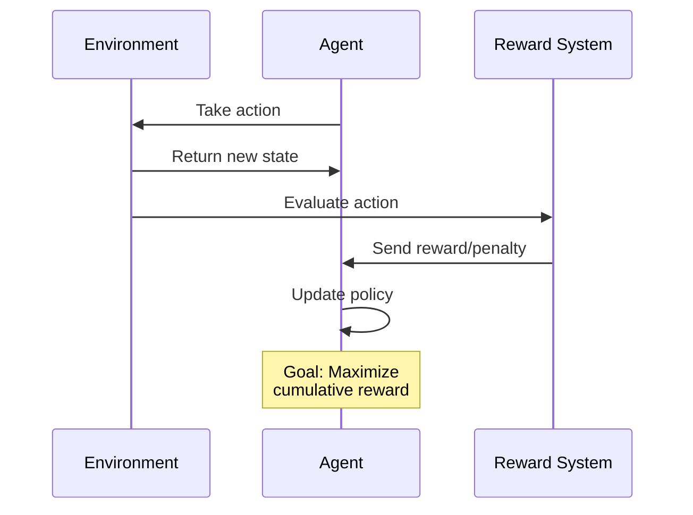

**Definition**: Training models to evaluate environments and maximize reward functions.

**Characteristics:**
- Learns through trial and error
- Maximizes rewards (vs. minimizing loss)
- No labeled data required
- Agent interacts with environment

**Example: Game Playing**

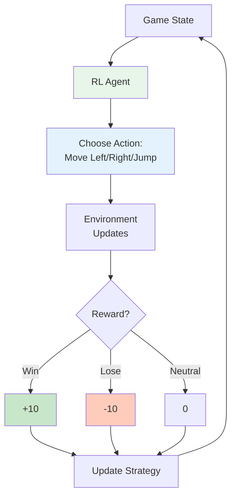

**Applications:**
- Game AI (AlphaGo, chess)
- Robotics control
- Resource optimization
- Autonomous vehicles

### 4. Hybrid Approaches

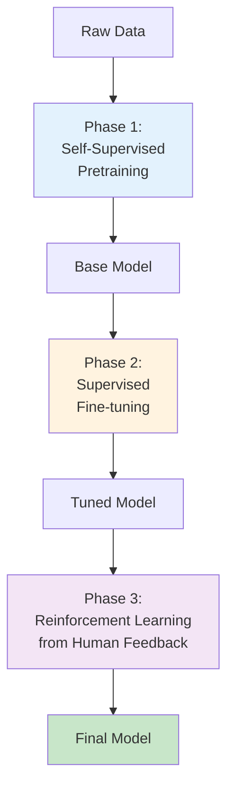

**Modern Approach**: Large language models (LLMs) combine multiple paradigms:

1. **Self-supervised pretraining**: Learn from unlabeled text
2. **Supervised fine-tuning**: Refine on labeled examples
3. **RLHF** (Reinforcement Learning from Human Feedback): Align with human preferences

**Example: ChatGPT Training Pipeline**

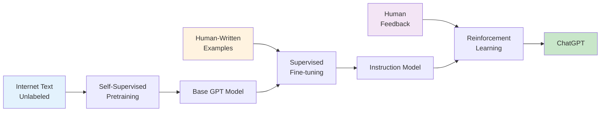

## Training Lifecycle

### Complete ML Model Lifecycle

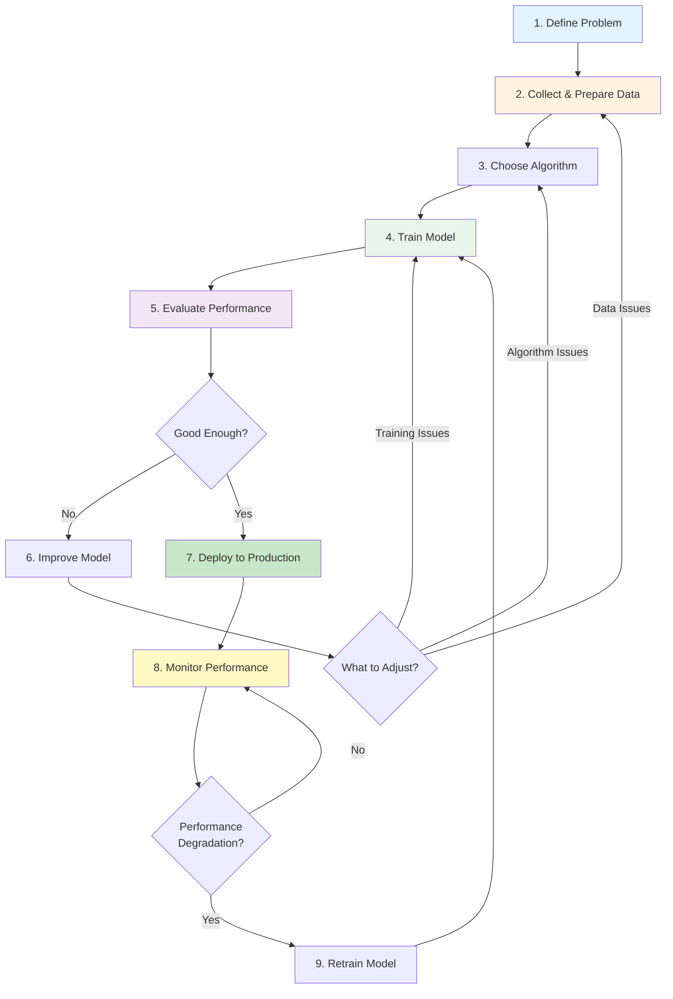

### Training Phase Details

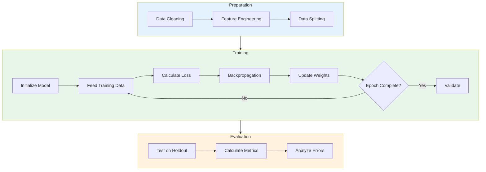

### Iterative Improvement Cycle

```mermaid
flowchart LR
    Train[Train Model] --> Val[Validate]
    Val --> Metrics[Check Metrics]
    Metrics --> Good{Satisfactory?}
    Good -->|No| Debug[Debug Issues]
    Debug --> Issue{Issue Type?}
    Issue -->|Underfitting| Complex[Increase<br/>Complexity]
    Issue -->|Overfitting| Simple[Reduce<br/>Complexity]
    Issue -->|Poor Data| Data[Improve<br/>Data Quality]
    Complex --> Train
    Simple --> Train
    Data --> Train
    Good -->|Yes| Production[Deploy]

    style Train fill:#e8f5e9
    style Val fill:#fff3e0
    style Debug fill:#ffccbc
    style Production fill:#c8e6c9
```

## Key Concepts

### 1. Loss Functions

```mermaid
graph TB
    Pred[Model Predictions] --> Loss[Loss Function]
    True[True Labels] --> Loss
    Loss --> Value[Loss Value<br/>Lower = Better]
    Value --> Optimize[Optimizer]
    Optimize --> Update[Update Parameters]

    Loss --> Types[Common Types]
    Types --> MSE[Mean Squared Error<br/>Regression]
    Types --> CE[Cross-Entropy<br/>Classification]
    Types --> MAE[Mean Absolute Error<br/>Regression]

    style Loss fill:#ffebee
    style Value fill:#fff3e0
    style Optimize fill:#e8f5e9
```

**Purpose**: Quantify how far predictions are from actual values.

**Common Loss Functions:**

| Loss Function | Use Case | Formula Concept |
|---------------|----------|-----------------|
| Mean Squared Error (MSE) | Regression | Average of squared differences |
| Cross-Entropy | Classification | Difference in probability distributions |
| Mean Absolute Error (MAE) | Regression | Average of absolute differences |
| Hinge Loss | SVM Classification | Margin-based classification |

### 2. Optimization & Gradient Descent

```mermaid
graph TB
    Start[Random<br/>Parameters] --> Calc[Calculate Loss]
    Calc --> Grad[Compute Gradients<br/>Loss/Weights]
    Grad --> Update[Update Parameters<br/>w = w - ± × gradient]
    Update --> Next[New Parameters]
    Next --> Check{Converged?}
    Check -->|No| Calc
    Check -->|Yes| Final[Optimal<br/>Parameters]

    style Start fill:#e3f2fd
    style Grad fill:#fff3e0
    style Update fill:#e8f5e9
    style Final fill:#c8e6c9
```

**Gradient Descent Visualization:**

```mermaid
graph LR
    High[High Loss<br/>Poor Model] --> Step1[Gradient Step 1]
    Step1 --> Step2[Gradient Step 2]
    Step2 --> Step3[Gradient Step 3]
    Step3 --> Low[Low Loss<br/>Good Model]

    style High fill:#ffccbc
    style Step1 fill:#fff9c4
    style Step2 fill:#fff9c4
    style Step3 fill:#fff9c4
    style Low fill:#c8e6c9
```

**Key Parameters:**
- **Learning Rate (±)**: Controls step size in parameter updates
- **Batch Size**: Number of samples processed before updating
- **Epochs**: Number of complete passes through training data

### 3. Overfitting vs Underfitting

```mermaid
graph TB
    Model[Model Complexity] --> Under[Underfitting<br/>Too Simple]
    Model --> Good[Good Fit<br/>Just Right]
    Model --> Over[Overfitting<br/>Too Complex]

    Under --> U1[High Training Error]
    Under --> U2[High Test Error]

    Good --> G1[Low Training Error]
    Good --> G2[Low Test Error]

    Over --> O1[Very Low Training Error]
    Over --> O2[High Test Error]

    style Under fill:#ffccbc
    style Good fill:#c8e6c9
    style Over fill:#ffccbc
    style U1 fill:#ffebee
    style U2 fill:#ffebee
    style G1 fill:#e8f5e9
    style G2 fill:#e8f5e9
    style O1 fill:#fff9c4
    style O2 fill:#ffebee
```

**The Bias-Variance Tradeoff:**

```mermaid
flowchart LR
    Simple[Simple Model<br/>High Bias] --> Sweet[Sweet Spot<br/>Balanced]
    Sweet --> Complex[Complex Model<br/>High Variance]

    Simple -.->|Underfits| Poor1[Poor Performance]
    Complex -.->|Overfits| Poor2[Poor Performance]
    Sweet -.->|Generalizes| Good[Good Performance]

    style Simple fill:#e3f2fd
    style Sweet fill:#c8e6c9
    style Complex fill:#f3e5f5
    style Poor1 fill:#ffccbc
    style Poor2 fill:#ffccbc
    style Good fill:#c8e6c9
```

**Solutions:**

| Problem | Symptoms | Solutions |
|---------|----------|-----------|
| **Underfitting** | High training error, high test error | Increase model complexity, add features, train longer |
| **Overfitting** | Low training error, high test error | Regularization, dropout, more data, early stopping |

### 4. Regularization Techniques

```mermaid
graph TB
    Over[Overfitting Risk] --> Reg[Regularization<br/>Techniques]

    Reg --> L1[L1 Regularization<br/>Lasso]
    Reg --> L2[L2 Regularization<br/>Ridge]
    Reg --> Drop[Dropout]
    Reg --> Early[Early Stopping]
    Reg --> Aug[Data Augmentation]

    L1 --> L1E[Feature Selection<br/>Sparse Models]
    L2 --> L2E[Weight Shrinkage<br/>Smoother Models]
    Drop --> DropE[Random Neuron<br/>Deactivation]
    Early --> EarlyE[Stop Before<br/>Overfitting]
    Aug --> AugE[Increase Effective<br/>Dataset Size]

    style Over fill:#ffebee
    style Reg fill:#fff3e0
    style L1 fill:#e3f2fd
    style L2 fill:#e3f2fd
    style Drop fill:#e3f2fd
    style Early fill:#e3f2fd
    style Aug fill:#e3f2fd
```

### 5. Hyperparameters vs Parameters

```mermaid
graph LR
    subgraph Parameters
        P1[Learned During Training]
        P2[Weights]
        P3[Biases]
    end

    subgraph Hyperparameters
        H1[Set Before Training]
        H2[Learning Rate]
        H3[Batch Size]
        H4[Epochs]
        H5[Architecture Choices]
    end

    Training[Training Process] --> P1
    Human[Human/AutoML] --> H1

    style Parameters fill:#e8f5e9
    style Hyperparameters fill:#e3f2fd
```

**Key Differences:**

| Aspect | Parameters | Hyperparameters |
|--------|-----------|-----------------|
| **When Set** | During training | Before training |
| **Who Sets** | Optimization algorithm | Data scientist / AutoML |
| **Examples** | Weights, biases | Learning rate, batch size, epochs |
| **Number** | Millions (in deep learning) | 5-20 typically |
| **Tuning** | Automatic via gradient descent | Manual or automated search |

### 6. Evaluation Metrics

```mermaid
graph TB
    Task[Task Type] --> Class[Classification]
    Task --> Reg[Regression]

    Class --> C1[Accuracy]
    Class --> C2[Precision/Recall]
    Class --> C3[F1 Score]
    Class --> C4[ROC-AUC]
    Class --> C5[Confusion Matrix]

    Reg --> R1[Mean Squared Error]
    Reg --> R2[Mean Absolute Error]
    Reg --> R3[R² Score]
    Reg --> R4[Root MSE]

    style Class fill:#e3f2fd
    style Reg fill:#fff3e0
    style C1 fill:#e8f5e9
    style C2 fill:#e8f5e9
    style C3 fill:#e8f5e9
    style R1 fill:#f3e5f5
    style R2 fill:#f3e5f5
    style R3 fill:#f3e5f5
```

**Classification Metrics:**

```mermaid
graph TB
    Pred[Predictions] --> Matrix[Confusion Matrix]
    Matrix --> TP[True Positives]
    Matrix --> TN[True Negatives]
    Matrix --> FP[False Positives]
    Matrix --> FN[False Negatives]

    TP --> Metrics[Calculate Metrics]
    TN --> Metrics
    FP --> Metrics
    FN --> Metrics

    Metrics --> Acc[Accuracy<br/>TP+TN / Total]
    Metrics --> Prec[Precision<br/>TP / TP+FP]
    Metrics --> Rec[Recall<br/>TP / TP+FN]

    style Matrix fill:#e3f2fd
    style Metrics fill:#fff3e0
    style Acc fill:#e8f5e9
    style Prec fill:#e8f5e9
    style Rec fill:#e8f5e9
```

## Best Practices

### 1. Data Quality First

```mermaid
flowchart TB
    Start[Raw Data] --> Quality{Quality<br/>Check}
    Quality -->|Poor| Clean[Data Cleaning]
    Clean --> Label[Proper Labeling]
    Quality -->|Good| Label
    Label --> Balance[Check Balance]
    Balance --> Imbalanced{Imbalanced?}
    Imbalanced -->|Yes| Fix[Resampling/<br/>Weighting]
    Imbalanced -->|No| Ready[Training Ready]
    Fix --> Ready

    style Start fill:#e3f2fd
    style Clean fill:#fff3e0
    style Ready fill:#c8e6c9
```

**Key Principles:**
- **Garbage In, Garbage Out**: High-quality data is essential
- **Representative Sampling**: Data should reflect real-world distribution
- **Sufficient Volume**: More data generally improves performance
- **Proper Labeling**: Accurate labels for supervised learning

### 2. Start Simple, Then Iterate

```mermaid
graph LR
    Simple[Simple Baseline<br/>Linear/Logistic] --> Eval1[Evaluate]
    Eval1 --> Good1{Good Enough?}
    Good1 -->|Yes| Done[Deploy]
    Good1 -->|No| Medium[Medium Complexity<br/>Random Forest]
    Medium --> Eval2[Evaluate]
    Eval2 --> Good2{Good Enough?}
    Good2 -->|Yes| Done
    Good2 -->|No| Complex[Complex Model<br/>Deep Learning]
    Complex --> Eval3[Evaluate]
    Eval3 --> Done

    style Simple fill:#e3f2fd
    style Medium fill:#fff3e0
    style Complex fill:#f3e5f5
    style Done fill:#c8e6c9
```

**Advantages:**
- Establish baseline performance
- Understand if complex models are necessary
- Faster iteration and debugging
- Easier to explain and maintain

### 3. Proper Data Splitting

```mermaid
graph TB
    All[(All Data<br/>100%)] --> Split[Split Strategy]

    Split --> Train[(Training<br/>70-80%)]
    Split --> Val[(Validation<br/>10-15%)]
    Split --> Test[(Test<br/>10-15%)]

    Train --> T1[Model Learning]
    Val --> V1[Hyperparameter<br/>Tuning]
    Test --> Te1[Final Evaluation<br/>NEVER touch<br/>until the end]

    style All fill:#e3f2fd
    style Train fill:#e8f5e9
    style Val fill:#fff3e0
    style Test fill:#ffebee
```

**Critical Rules:**
- **Never** use test data during training or tuning
- **Stratified** sampling for imbalanced datasets
- **Time-based** split for temporal data
- **K-fold** cross-validation for small datasets

### 4. Monitor Training Progress

```mermaid
flowchart LR
    Train[Training] --> Track[Track Metrics]
    Track --> Plot[Plot Curves]
    Plot --> Analyze[Analyze Patterns]

    Analyze --> Pattern1{Pattern?}
    Pattern1 -->|Training & Validation<br/>both decreasing| Good[Good Progress]
    Pattern1 -->|Training decreasing,<br/>Validation increasing| Over[Overfitting]
    Pattern1 -->|Both high| Under[Underfitting]

    Over --> Action1[Add Regularization]
    Under --> Action2[Increase Complexity]
    Good --> Continue[Continue Training]

    style Train fill:#e8f5e9
    style Good fill:#c8e6c9
    style Over fill:#ffccbc
    style Under fill:#ffccbc
```

**What to Track:**
- Training loss vs. validation loss
- Accuracy metrics over epochs
- Learning rate schedules
- Gradient magnitudes
- Training time per epoch

### 5. Hyperparameter Tuning

```mermaid
graph TB
    Start[Initial Hyperparameters] --> Method{Tuning Method}

    Method -->|Manual| Manual[Manual Search<br/>Trial & Error]
    Method -->|Systematic| Grid[Grid Search<br/>Exhaustive]
    Method -->|Smart| Random[Random Search<br/>Sampling]
    Method -->|Advanced| Bayesian[Bayesian Optimization<br/>Informed Search]

    Manual --> Eval[Evaluate]
    Grid --> Eval
    Random --> Eval
    Bayesian --> Eval

    Eval --> Best[Best Configuration]

    style Method fill:#e3f2fd
    style Manual fill:#ffccbc
    style Grid fill:#fff9c4
    style Random fill:#fff3e0
    style Bayesian fill:#c8e6c9
    style Best fill:#e8f5e9
```

**Tuning Strategy:**

| Method | When to Use | Pros | Cons |
|--------|-------------|------|------|
| **Manual** | Small projects, exploration | Intuitive, flexible | Time-consuming, biased |
| **Grid Search** | Few hyperparameters | Exhaustive | Computationally expensive |
| **Random Search** | Many hyperparameters | Often better than grid | No guarantee of optimum |
| **Bayesian** | Expensive models | Most efficient | Complex to implement |

### 6. Version Control for ML

```mermaid
flowchart TB
    Code[Code Version] --> Track[Version Control]
    Data[Data Version] --> Track
    Model[Model Version] --> Track
    Params[Hyperparameters] --> Track
    Metrics[Metrics] --> Track

    Track --> Tools[Tools]
    Tools --> Git[Git<br/>Code]
    Tools --> DVC[DVC<br/>Data]
    Tools --> MLflow[MLflow<br/>Experiments]
    Tools --> Weights[Weights & Biases<br/>Full Tracking]

    style Track fill:#e8f5e9
    style Code fill:#e3f2fd
    style Data fill:#e3f2fd
    style Model fill:#e3f2fd
    style Params fill:#e3f2fd
    style Metrics fill:#e3f2fd
```

**What to Track:**
- Code versions (Git)
- Dataset versions (DVC, Git LFS)
- Model architectures
- Hyperparameter configurations
- Training metrics and results
- Environment dependencies

## Common Challenges

### Challenge Overview

```mermaid
mindmap
  root((Training<br/>Challenges))
    Data Issues
      Insufficient Data
      Imbalanced Classes
      Poor Quality
      Label Noise
    Model Issues
      Overfitting
      Underfitting
      Slow Convergence
      Vanishing Gradients
    Resource Issues
      Computational Cost
      Memory Limitations
      Training Time
    Deployment Issues
      Model Drift
      Scalability
      Latency
```

### 1. Insufficient Training Data

```mermaid
flowchart TB
    Problem[Not Enough Data] --> Solutions[Solutions]

    Solutions --> Aug[Data Augmentation<br/>Synthetic Variations]
    Solutions --> Transfer[Transfer Learning<br/>Pretrained Models]
    Solutions --> Synthetic[Synthetic Data<br/>Generation]
    Solutions --> Collect[Collect More Data]

    Aug --> Example1[Images: Rotate, Flip, Crop]
    Transfer --> Example2[Use ImageNet<br/>Pretrained Model]
    Synthetic --> Example3[GANs, Simulations]

    style Problem fill:#ffebee
    style Solutions fill:#fff3e0
    style Aug fill:#e8f5e9
    style Transfer fill:#e8f5e9
    style Synthetic fill:#e8f5e9
    style Collect fill:#e8f5e9
```

### 2. Class Imbalance

```mermaid
graph TB
    Imbalance[Imbalanced Dataset<br/>95% Class A, 5% Class B] --> Approaches[Approaches]

    Approaches --> Resample[Resampling]
    Approaches --> Weight[Class Weights]
    Approaches --> Metric[Different Metrics]

    Resample --> Over[Oversample Minority]
    Resample --> Under[Undersample Majority]
    Resample --> SMOTE[SMOTE<br/>Synthetic Samples]

    Weight --> Adjust[Adjust Loss Function<br/>Penalize Minority Errors More]

    Metric --> F1[Use F1 Score<br/>Not Accuracy]

    style Imbalance fill:#ffebee
    style Approaches fill:#fff3e0
    style Over fill:#e8f5e9
    style Under fill:#e8f5e9
    style SMOTE fill:#e8f5e9
```

### 3. Vanishing/Exploding Gradients

```mermaid
flowchart LR
    Deep[Deep Neural Network] --> Problem{Gradient<br/>Issue}

    Problem -->|Too Small| Vanish[Vanishing<br/>Gradients]
    Problem -->|Too Large| Explode[Exploding<br/>Gradients]

    Vanish --> Sol1[Solutions]
    Explode --> Sol2[Solutions]

    Sol1 --> V1[ReLU Activation]
    Sol1 --> V2[Batch Normalization]
    Sol1 --> V3[Residual Connections]

    Sol2 --> E1[Gradient Clipping]
    Sol2 --> E2[Lower Learning Rate]
    Sol2 --> E3[Batch Normalization]

    style Problem fill:#ffebee
    style Vanish fill:#ffccbc
    style Explode fill:#ffccbc
    style V1 fill:#c8e6c9
    style E1 fill:#c8e6c9
```

### 4. Computational Resources

```mermaid
graph TB
    Resources[Limited Resources] --> Strategies[Optimization Strategies]

    Strategies --> Model[Model Optimization]
    Strategies --> Data[Data Optimization]
    Strategies --> Compute[Compute Optimization]

    Model --> M1[Smaller Architecture]
    Model --> M2[Model Compression]
    Model --> M3[Knowledge Distillation]

    Data --> D1[Batch Size Tuning]
    Data --> D2[Mixed Precision]
    Data --> D3[Data Sampling]

    Compute --> C1[Cloud GPUs]
    Compute --> C2[Distributed Training]
    Compute --> C3[Gradient Accumulation]

    style Resources fill:#ffebee
    style Strategies fill:#fff3e0
    style M1 fill:#e8f5e9
    style D1 fill:#e3f2fd
    style C1 fill:#f3e5f5
```

**Resource Management:**

| Strategy | Description | When to Use |
|----------|-------------|-------------|
| **Mixed Precision** | Use 16-bit instead of 32-bit floats | GPUs with Tensor Cores |
| **Gradient Accumulation** | Simulate larger batches | Memory constraints |
| **Model Parallelism** | Split model across devices | Very large models |
| **Data Parallelism** | Replicate model across devices | Large datasets |

### 5. Model Drift in Production

```mermaid
flowchart TB
    Deploy[Deployed Model] --> Monitor[Monitor Performance]
    Monitor --> Check{Performance<br/>Degrading?}
    Check -->|No| Continue[Continue Monitoring]
    Continue --> Monitor
    Check -->|Yes| Diagnose[Diagnose Issue]

    Diagnose --> Type{Drift Type?}
    Type -->|Data Drift| DataFix[Retrain with<br/>New Data]
    Type -->|Concept Drift| ConceptFix[Update Model<br/>Architecture]
    Type -->|Label Drift| LabelFix[Update<br/>Labels]

    DataFix --> Retrain[Retrain Model]
    ConceptFix --> Retrain
    LabelFix --> Retrain
    Retrain --> Deploy

    style Deploy fill:#e8f5e9
    style Check fill:#fff3e0
    style Diagnose fill:#ffebee
    style Retrain fill:#c8e6c9
```

## Tools and Platforms

### Complete ML Toolchain

```mermaid
graph TB
    subgraph Development
        D1[Jupyter Notebooks]
        D2[VS Code]
        D3[PyCharm]
    end

    subgraph Frameworks
        F1[TensorFlow/Keras]
        F2[PyTorch]
        F3[Scikit-learn]
        F4[XGBoost]
    end

    subgraph Tracking
        T1[MLflow]
        T2[Weights & Biases]
        T3[TensorBoard]
    end

    subgraph Cloud
        C1[AWS SageMaker]
        C2[Google Vertex AI]
        C3[Azure ML]
    end

    subgraph AutoML
        A1[H2O.ai]
        A2[Google AutoML]
        A3[Auto-sklearn]
    end

    Development --> Frameworks
    Frameworks --> Tracking
    Tracking --> Cloud
    Cloud --> AutoML

    style Development fill:#e3f2fd
    style Frameworks fill:#e8f5e9
    style Tracking fill:#fff3e0
    style Cloud fill:#f3e5f5
    style AutoML fill:#fce4ec
```

### Framework Comparison

```mermaid
graph LR
    Task{Choose Framework} --> Research[Research<br/>Flexibility]
    Task --> Production[Production<br/>Deployment]
    Task --> Classic[Classical ML]
    Task --> Gradient[Gradient Boosting]

    Research --> PyTorch[PyTorch]
    Production --> TF[TensorFlow]
    Classic --> Sklearn[Scikit-learn]
    Gradient --> XGB[XGBoost]

    style Task fill:#fff3e0
    style PyTorch fill:#e8f5e9
    style TF fill:#e8f5e9
    style Sklearn fill:#e8f5e9
    style XGB fill:#e8f5e9
```

**Framework Selection Guide:**

| Framework | Best For | Strengths | Learning Curve |
|-----------|----------|-----------|----------------|
| **Scikit-learn** | Classical ML, beginners | Simple API, well-documented | Low |
| **TensorFlow/Keras** | Production, deployment | Scalability, ecosystem | Medium |
| **PyTorch** | Research, flexibility | Dynamic graphs, Pythonic | Medium |
| **XGBoost** | Tabular data, competitions | Performance, speed | Low-Medium |

### Cloud Platforms

```mermaid
graph TB
    Local[Local Development] --> Cloud{Scale Up?}
    Cloud -->|Yes| Choose[Choose Platform]

    Choose --> AWS[AWS SageMaker]
    Choose --> GCP[Google Vertex AI]
    Choose --> Azure[Azure ML]

    AWS --> Features1[Managed Training<br/>AutoML<br/>Model Registry]
    GCP --> Features2[AutoML<br/>Vertex Pipelines<br/>Feature Store]
    Azure --> Features3[Designer<br/>AutoML<br/>MLOps]

    style Local fill:#e3f2fd
    style AWS fill:#fff9c4
    style GCP fill:#c8e6c9
    style Azure fill:#e1f5fe
```

**Platform Capabilities:**

| Platform | Strengths | Best For |
|----------|-----------|----------|
| **AWS SageMaker** | Comprehensive ecosystem, scalability | Enterprise, diverse workloads |
| **Google Vertex AI** | AutoML, BigQuery integration | Data analytics, quick deployment |
| **Azure ML** | Microsoft integration, Designer | Microsoft shops, hybrid cloud |
| **Databricks** | Spark integration, MLflow | Big data + ML |

### Experiment Tracking

```mermaid
flowchart LR
    Exp[Experiment] --> Log[Log to Tracker]

    Log --> Params[Parameters<br/>Learning Rate<br/>Batch Size]
    Log --> Metrics[Metrics<br/>Accuracy<br/>Loss]
    Log --> Artifacts[Artifacts<br/>Models<br/>Plots]

    Params --> Dashboard[Dashboard]
    Metrics --> Dashboard
    Artifacts --> Dashboard

    Dashboard --> Compare[Compare Runs]
    Compare --> Best[Select Best Model]

    style Exp fill:#e3f2fd
    style Log fill:#fff3e0
    style Dashboard fill:#e8f5e9
    style Best fill:#c8e6c9
```

**Popular Tools:**

- **MLflow**: Open-source, tracking + deployment
- **Weights & Biases**: Collaboration, visualization
- **TensorBoard**: TensorFlow integration, real-time
- **Neptune.ai**: Team collaboration, metadata management

## Example: Complete Training Workflow

### End-to-End Example

```mermaid
flowchart TD
    Start([Start Project]) --> Problem[Define Problem<br/>Predict House Prices]
    Problem --> Collect[Collect Data<br/>House Features + Prices]
    Collect --> EDA[Exploratory Analysis<br/>Visualize Distributions]
    EDA --> Clean[Clean Data<br/>Handle Missing Values]
    Clean --> Split[Split Data<br/>70% Train, 15% Val, 15% Test]

    Split --> Baseline[Train Baseline<br/>Linear Regression]
    Baseline --> EvalBase[Evaluate<br/>RMSE: $50k]

    EvalBase --> Try2[Try Random Forest<br/>100 trees]
    Try2 --> EvalRF[Evaluate<br/>RMSE: $35k]

    EvalRF --> Tune[Hyperparameter Tuning<br/>Grid Search]
    Tune --> EvalTuned[Evaluate<br/>RMSE: $30k]

    EvalTuned --> Final[Final Test<br/>RMSE: $32k]
    Final --> Deploy[Deploy to Production]
    Deploy --> Monitor[Monitor Performance]
    Monitor --> End([Complete])

    style Start fill:#e8f5e9
    style Problem fill:#e3f2fd
    style EDA fill:#fff3e0
    style Baseline fill:#f3e5f5
    style Try2 fill:#fff9c4
    style Tune fill:#fce4ec
    style Deploy fill:#c8e6c9
    style End fill:#c8e6c9
```

## Key Takeaways

```mermaid
mindmap
  root((Model Training<br/>Success))
    Quality Data
      Representative
      Sufficient Volume
      Properly Labeled
      Clean & Balanced
    Right Algorithm
      Match Task
      Start Simple
      Iterate
      Consider Resources
    Proper Validation
      Train/Val/Test Split
      Cross-Validation
      Right Metrics
      Monitor Overfitting
    Systematic Tuning
      Hyperparameters
      Track Experiments
      Reproducibility
      Version Control
    Production Ready
      Scalability
      Monitoring
      Retraining Pipeline
      Documentation
```

**Essential Principles:**

1. **Data Quality > Model Complexity**: Better data beats fancier algorithms
2. **Start Simple**: Establish baselines before complex models
3. **Monitor Everything**: Track metrics, visualize progress
4. **Prevent Overfitting**: Use validation sets and regularization
5. **Iterate Systematically**: Change one thing at a time
6. **Version Control**: Track code, data, models, and experiments
7. **Think Production**: Plan for deployment from the start
8. **Continuous Learning**: Models need retraining as data evolves

## Further Learning

### Learning Path

```mermaid
flowchart LR
    Beginner[Beginner] --> Inter[Intermediate]
    Inter --> Advanced[Advanced]
    Advanced --> Expert[Expert]

    Beginner --> B1[Scikit-learn Basics<br/>Linear Models<br/>Decision Trees]

    Inter --> I1[Deep Learning<br/>PyTorch/TensorFlow<br/>CNNs, RNNs]

    Advanced --> A1[Advanced Architectures<br/>Transformers<br/>GANs]

    Expert --> E1[Research<br/>Novel Architectures<br/>State-of-the-Art]

    style Beginner fill:#e3f2fd
    style Inter fill:#fff3e0
    style Advanced fill:#f3e5f5
    style Expert fill:#fce4ec
```

### Recommended Resources

**Online Courses:**
- [Andrew Ng - Machine Learning Specialization (Coursera)](https://www.coursera.org/specializations/machine-learning-introduction)
- [Fast.ai - Practical Deep Learning](https://course.fast.ai/)
- [DeepLearning.AI - Deep Learning Specialization](https://www.deeplearning.ai/courses/deep-learning-specialization/)

**Books:**
- "Hands-On Machine Learning" by Aurélien Géron
- "Deep Learning" by Goodfellow, Bengio, and Courville
- "Pattern Recognition and Machine Learning" by Christopher Bishop

**Documentation:**
- [Scikit-learn Documentation](https://scikit-learn.org/)
- [PyTorch Tutorials](https://pytorch.org/tutorials/)
- [TensorFlow Guides](https://www.tensorflow.org/guide)

**Practice:**
- [Kaggle Competitions](https://www.kaggle.com/competitions)
- [Google Colab](https://colab.research.google.com/) - Free GPU/TPU
- [Papers With Code](https://paperswithcode.com/) - Latest research + code

---

**Summary**: Model training is an iterative process of teaching machines to learn from data. Success requires quality data, appropriate algorithms, systematic validation, and continuous monitoring. Start simple, iterate based on results, and always think about production deployment from the beginning.
